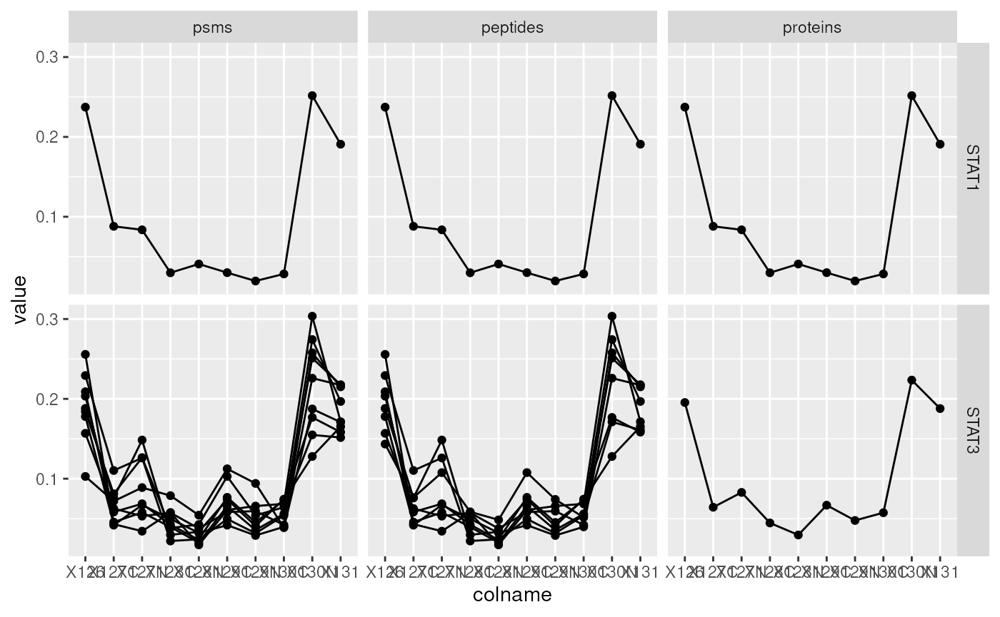

# Quantitative features for mass spectrometry data

Abstract

This vignette describes the functionality implemented in the QFeatures
package. QFeatures provides infrastructure to manage and process
quantitative features for high-throughput mass spectrometry assays,
including proteomics and metabolomics. This vignette is distributed
under a CC BY-SA license.

## Introduction

The `QFeatures` package provides infrastructure (that is classes to
store data and the methods to process and manipulate them) to manage and
analyse quantitative features from mass spectrometry experiments. It is
based on the `SummarizedExperiment` and `MultiAssayExperiment` classes.
Assays in a QFeatures object have a hierarchical relation: proteins are
composed of peptides, themselves produced by spectra, as depicted in
figure @ref(fig:featuresplot). Throughout the aggregation and processing
of these data, the relations between assays are tracked and recorded,
thus allowing users to easily navigate across spectra, peptide and
protein quantitative data.


Conceptual representation of a `QFeatures` object and the aggregative
relation between different assays.

In the following sections, we are going to demonstrate how to create a
single-assay `QFeatures` objects starting from a spreadsheet, how to
compute the next assays (peptides and proteins), and how these can be
manipulated and explored.

``` r

library("QFeatures")
```

## Creating `QFeatures` object

While `QFeatures` objects can be created manually (see
[`?QFeatures`](https://rformassspectrometry.github.io/QFeatures/reference/QFeatures-class.md)
for details), most users will probably possess quantitative data in a
spreadsheet or a dataframe. In such cases, the easiest is to use the
`readQFeatures` function to extract the quantitative data and metadata
columns. Below, we load the `hlpsms` dataframe that contains data for
3010 PSMs from the TMT-10plex hyperLOPIT spatial proteomics experiment
from (Christoforou et al. 2016). The `quantCols` argument specifies that
columns 1 to 10 contain quantitation data, and that the assay should be
named `psms` in the returned `QFeatures` object, to reflect the nature
of the data.

``` r

data(hlpsms)
hl <- readQFeatures(hlpsms, quantCols = 1:10, name = "psms")
```

    ## Checking arguments.

    ## Loading data as a 'SummarizedExperiment' object.

    ## Formatting sample annotations (colData).

    ## Formatting data as a 'QFeatures' object.

``` r

hl
```

    ## An instance of class QFeatures (type: bulk) with 1 set:
    ## 
    ##  [1] psms: SummarizedExperiment with 3010 rows and 10 columns

Below, we see that we can extract an assay using its index or its name.
The individual assays are stored as *SummarizedExperiment* object and
further access its quantitative data and metadata using the `assay` and
`rowData` functions

``` r

hl[[1]]
```

    ## class: SummarizedExperiment 
    ## dim: 3010 10 
    ## metadata(0):
    ## assays(1): ''
    ## rownames(3010): 1 2 ... 3009 3010
    ## rowData names(18): Sequence ProteinDescriptions ... RTmin markers
    ## colnames(10): X126 X127C ... X130N X131
    ## colData names(0):

``` r

hl[["psms"]]
```

    ## class: SummarizedExperiment 
    ## dim: 3010 10 
    ## metadata(0):
    ## assays(1): ''
    ## rownames(3010): 1 2 ... 3009 3010
    ## rowData names(18): Sequence ProteinDescriptions ... RTmin markers
    ## colnames(10): X126 X127C ... X130N X131
    ## colData names(0):

``` r

head(assay(hl[["psms"]]))
```

    ##         X126      X127C       X127N      X128C       X128N      X129C
    ## 1 0.12283431 0.08045915 0.070804055 0.09386901 0.051815695 0.13034383
    ## 2 0.35268185 0.14162381 0.167523880 0.07843497 0.071087436 0.03214548
    ## 3 0.01546089 0.16142297 0.086938133 0.23120844 0.114664348 0.09610188
    ## 4 0.04702854 0.09288723 0.102012167 0.11125409 0.067969116 0.14155358
    ## 5 0.01044693 0.15866147 0.167315736 0.21017494 0.147946673 0.07088253
    ## 6 0.04955362 0.01215244 0.002477681 0.01297833 0.002988949 0.06253195
    ##        X129N       X130C      X130N       X131
    ## 1 0.17540095 0.040068658 0.11478839 0.11961594
    ## 2 0.06686260 0.031961793 0.02810434 0.02957384
    ## 3 0.15977819 0.010127118 0.08059400 0.04370403
    ## 4 0.18015910 0.035329902 0.12166589 0.10014038
    ## 5 0.17555789 0.007088253 0.02884754 0.02307803
    ## 6 0.01726511 0.172651119 0.37007905 0.29732174

``` r

head(rowData(hl[["psms"]]))
```

    ## DataFrame with 6 rows and 18 columns
    ##      Sequence ProteinDescriptions NbProteins ProteinGroupAccessions
    ##   <character>         <character>  <integer>            <character>
    ## 1     SQGEIDk       Tetratrico...          1                 Q8BYY4
    ## 2     YEAQGDk       Vacuolar p...          1                 P46467
    ## 3     TTScDTk       C-type man...          1                 Q64449
    ## 4     aEELESR       Liprin-alp...          1                 P60469
    ## 5     aQEEAIk       Isoform 2 ...          2               P13597-2
    ## 6    dGAVDGcR       Structural...          1                 Q6P5D8
    ##   Modifications    qValue       PEP  IonScore NbMissedCleavages
    ##     <character> <numeric> <numeric> <integer>         <integer>
    ## 1 K7(TMT6ple...     0.008   0.11800        27                 0
    ## 2 K7(TMT6ple...     0.001   0.01070        27                 0
    ## 3 C4(Carbami...     0.008   0.11800        11                 0
    ## 4 N-Term(TMT...     0.002   0.04450        24                 0
    ## 5 N-Term(Car...     0.001   0.00850        36                 0
    ## 6 N-Term(TMT...     0.000   0.00322        26                 0
    ##   IsolationInterference IonInjectTimems Intensity    Charge      mzDa      MHDa
    ##               <integer>       <integer> <numeric> <integer> <numeric> <numeric>
    ## 1                     0              70    335000         2   503.274   1005.54
    ## 2                     0              70    926000         2   520.267   1039.53
    ## 3                     0              70    159000         2   521.258   1041.51
    ## 4                     0              70    232000         2   531.785   1062.56
    ## 5                     0              70    212000         2   537.804   1074.60
    ## 6                     0              70    865000         2   539.761   1078.51
    ##   DeltaMassPPM     RTmin       markers
    ##      <numeric> <numeric>   <character>
    ## 1        -0.38     24.02       unknown
    ## 2         0.61     18.85       unknown
    ## 3         1.11     10.17       unknown
    ## 4         0.35     29.18       unknown
    ## 5         1.70     25.56 Plasma mem...
    ## 6        -0.67     21.27 Nucleus - ...

For further details on how to manipulate such objects, refer to the
*[MultiAssayExperiment](https://bioconductor.org/packages/3.22/MultiAssayExperiment)*
(Ramos et al. 2017) and
*[SummarizedExperiment](https://bioconductor.org/packages/3.22/SummarizedExperiment)*
(Morgan et al. 2019) packages.

As illustrated in figure @ref(fig:featuresplot), an central
characteristic of `QFeatures` objects is the aggregative relation
between their assays. This can be obtained with the `aggregateFeatures`
function that will aggregate quantitative features from one assay into a
new one. In the next code chunk, we aggregate PSM-level data into
peptide by grouping all PSMs that were matched the same peptide
sequence. Below, the aggregation function is set, as an example, to the
mean. The new assay is named *peptides*.

``` r

hl <- aggregateFeatures(hl, "psms", "Sequence",
                        name = "peptides", fun = colMeans)
```

    ## Your row data contain missing values. Please read the relevant
    ## section(s) in the aggregateFeatures manual page regarding the effects
    ## of missing values on data aggregation.

    ## Aggregated: 1/1

``` r

hl
```

    ## An instance of class QFeatures (type: bulk) with 2 sets:
    ## 
    ##  [1] psms: SummarizedExperiment with 3010 rows and 10 columns 
    ##  [2] peptides: SummarizedExperiment with 2923 rows and 10 columns

``` r

hl[["peptides"]]
```

    ## class: SummarizedExperiment 
    ## dim: 2923 10 
    ## metadata(0):
    ## assays(2): assay aggcounts
    ## rownames(2923): aAADADVSLHNFSAR aAADPSEk ... yYSFFDLNPk YYSIASSSk
    ## rowData names(7): Sequence ProteinDescriptions ... markers .n
    ## colnames(10): X126 X127C ... X130N X131
    ## colData names(0):

Below, we repeat the aggregation operation by grouping peptides into
proteins as defined by the *ProteinGroupAccessions* variable.

``` r

hl <- aggregateFeatures(hl, "peptides", "ProteinGroupAccessions",
                        name = "proteins", fun = colMeans)
```

    ## Aggregated: 1/1

``` r

hl
```

    ## An instance of class QFeatures (type: bulk) with 3 sets:
    ## 
    ##  [1] psms: SummarizedExperiment with 3010 rows and 10 columns 
    ##  [2] peptides: SummarizedExperiment with 2923 rows and 10 columns 
    ##  [3] proteins: SummarizedExperiment with 1596 rows and 10 columns

``` r

hl[["proteins"]]
```

    ## class: SummarizedExperiment 
    ## dim: 1596 10 
    ## metadata(0):
    ## assays(2): assay aggcounts
    ## rownames(1596): A2A432 A2A6Q5-3 ... Q9Z2Z9 Q9Z315
    ## rowData names(3): ProteinGroupAccessions markers .n
    ## colnames(10): X126 X127C ... X130N X131
    ## colData names(0):

The sample assayed in a `QFeatures` object can be documented in the
`colData` slot. The `hl` data doens’t currently possess any sample
metadata. These can be addedd as a new `DataFrame` with matching names
(i.e. the `DataFrame` rownames must be identical assay’s colnames) or
can be added one variable at at time, as shown below.

``` r

colData(hl)
```

    ## DataFrame with 10 rows and 0 columns

``` r

hl$tag <- c("126", "127N", "127C", "128N", "128C", "129N", "129C",
            "130N", "130C", "131")
colData(hl)
```

    ## DataFrame with 10 rows and 1 column
    ##               tag
    ##       <character>
    ## X126          126
    ## X127C        127N
    ## X127N        127C
    ## X128C        128N
    ## X128N        128C
    ## X129C        129N
    ## X129N        129C
    ## X130C        130N
    ## X130N        130C
    ## X131          131

## Manipulating feature metadata

The `QFeatures` package provides some utility functions that streamline
the accession and manipulation of the feature metadata.

The feature metadata, more generally referred to as `rowData` in the
Bioconductor ecosystem, is specific to each assay in a `QFeatures`
object. Therefore there are as many `rowData` tables as there are
assays. `rowDataNames` provides a list where each element contains the
name of the `rowData` columns available in the corresponding assay.

``` r

rowDataNames(hl)
```

    ## CharacterList of length 3
    ## [["psms"]] Sequence ProteinDescriptions NbProteins ... RTmin markers
    ## [["peptides"]] Sequence ProteinDescriptions NbProteins ... markers .n
    ## [["proteins"]] ProteinGroupAccessions markers .n

We saw above how to get the `rowData` from an assay, but we can also
extract the `rowData` for all assays by calling the function on the
`QFeautures` object directly. Similarly to `rowDataNames`, a list is
returned where each element contains the `rowData` available in the
corresponding assay.

``` r

rowData(hl)
```

    ## DataFrameList of length 3
    ## names(3): psms peptides proteins

In some cases, we are interested in extracting the `rowData` as a single
data table. This is easily performed using the `rbindRowData` function.
The function will automatically select the columns that are common to
all selected assays.

``` r

rbindRowData(hl, i = c("peptides", "proteins"))
```

    ## DataFrame with 4519 rows and 5 columns
    ##            assay       rowname ProteinGroupAccessions       markers        .n
    ##      <character>   <character>            <character>   <character> <integer>
    ## 1       peptides aAADADVSLH...                 P0C7N9       unknown         1
    ## 2       peptides      aAADPSEk                 Q6P9Q6       unknown         1
    ## 3       peptides aAAQFLTSTW...                 Q9D7Z3 Nucleus - ...         1
    ## 4       peptides aAASGAAGDk...                 A2AGT5       unknown         1
    ## 5       peptides     AAAVSTEGk                 Q9ERE8       unknown         1
    ## ...          ...           ...                    ...           ...       ...
    ## 4515    proteins        Q9Z2V5                 Q9Z2V5       unknown         1
    ## 4516    proteins        Q9Z2W0                 Q9Z2W0       unknown         1
    ## 4517    proteins        Q9Z2X1                 Q9Z2X1       unknown         1
    ## 4518    proteins        Q9Z2Z9                 Q9Z2Z9       unknown         3
    ## 4519    proteins        Q9Z315                 Q9Z315       unknown         1

We can also replace and add columns in the `rowData`. This requires to
provide a `List` where the names of the `List` point to the assay to be
updated and the elements of the `List` contain `DataFrame`s with the
replacement values. If the `DataFrame` contains a column that is not
present in the `rowData`, that column will get added to the `rowData`.
For instance, let’s add a `rowData` variables with the mean protein
expression as well as the associated standard deviation. First, we need
to create the `DataFrame` with the mean expression.

``` r

dF <- DataFrame(mean = rowSums(assay(hl[["proteins"]])),
                sd = rowSds(assay(hl[["proteins"]])))
```

Then, we create the list and name the element `proteins` so that the new
data is added to the `rowData` of the `proteins` assay. To add the list,
we insert it back into the `rowData`.

``` r

rowData(hl) <- List(proteins = dF)
```

As shown below, the new `mean` and `sd` variables have been added to the
`rowData` of the `proteins` assay.

``` r

rowData(hl)[["proteins"]]
```

    ## DataFrame with 1596 rows and 5 columns
    ##          ProteinGroupAccessions     markers        .n      mean        sd
    ##                     <character> <character> <integer> <numeric> <numeric>
    ## A2A432                   A2A432     unknown         1         1 0.0822395
    ## A2A6Q5-3               A2A6Q5-3     unknown         1         1 0.0891478
    ## A2A8L5                   A2A8L5     unknown         2         1 0.1009041
    ## A2AF47                   A2AF47     unknown         1         1 0.0749159
    ## A2AGT5                   A2AGT5     unknown         6         1 0.1065126
    ## ...                         ...         ...       ...       ...       ...
    ## Q9Z2V5                   Q9Z2V5     unknown         1         1 0.0882136
    ## Q9Z2W0                   Q9Z2W0     unknown         1         1 0.0565321
    ## Q9Z2X1                   Q9Z2X1     unknown         1         1 0.1539930
    ## Q9Z2Z9                   Q9Z2Z9     unknown         3         1 0.0930030
    ## Q9Z315                   Q9Z315     unknown         1         1 0.1234534

Note that you can also replace an existing column in the `rowData` by
naming the column name in the `DataFrame` after the column to replace.

## Subsetting

One particularity of the `QFeatures` infrastructure is that the features
of the constitutive assays are linked through an aggregative relation.
This relation is recorded when creating new assays with
`aggregateFeatures` and is exploited when subsetting `QFeature` by their
feature names.

In the example below, we are interested in the Stat3B isoform of the
Signal transducer and activator of transcription 3 (STAT3) with
accession number P42227-2. This accession number corresponds to a
feature name in the *proteins* assay. But this protein row was computed
from 8 peptide rows in the *peptides* assay, themselves resulting from
the aggregation of 8 rows in the *psms* assay.

``` r

stat3 <- hl["P42227-2", , ]
stat3
```

    ## An instance of class QFeatures (type: bulk) with 3 sets:
    ## 
    ##  [1] psms: SummarizedExperiment with 9 rows and 10 columns 
    ##  [2] peptides: SummarizedExperiment with 8 rows and 10 columns 
    ##  [3] proteins: SummarizedExperiment with 1 rows and 10 columns

We can easily visualise this new *QFeatures* object using `ggplot2` once
converted into a `data.frame`. See the visualization vignette for more
details about data exploration from a `QFeatures` object.

``` r

stat3_df <- data.frame(longForm(stat3))
stat3_df$assay <- factor(stat3_df$assay,
                        levels = c("psms", "peptides", "proteins"))
library("ggplot2")
ggplot(data = stat3_df,
       aes(x = colname,
           y = value,
           group = rowname)) +
    geom_line() + geom_point() +
    facet_grid(~ assay)
```


Below we repeat the same operation for the Signal transducer and
activator of transcription 1 (STAT1) and 3 (STAT3) accession numbers,
namely P42227-2 and P42225. We obtain a new `QFeatures` instance
containing 2 proteins, 9 peptides and 10 PSMS. From this, we can readily
conclude that STAT1 was identified by a single PSM/peptide.

``` r

stat <- hl[c("P42227-2", "P42225"), , ]
stat
```

    ## An instance of class QFeatures (type: bulk) with 3 sets:
    ## 
    ##  [1] psms: SummarizedExperiment with 10 rows and 10 columns 
    ##  [2] peptides: SummarizedExperiment with 9 rows and 10 columns 
    ##  [3] proteins: SummarizedExperiment with 2 rows and 10 columns

Below, we visualise the expression profiles for the two proteins.

``` r

stat_df <- data.frame(longForm(stat))
stat_df$stat3 <- ifelse(stat_df$rowname %in% stat3_df$rowname,
                        "STAT3", "STAT1")
stat_df$assay <- factor(stat_df$assay,
                        levels = c("psms", "peptides", "proteins"))

ggplot(data = stat_df,
       aes(x = colname,
           y = value,
           group = rowname)) +
    geom_line() + geom_point() +
    facet_grid(stat3 ~ assay)
```



The subsetting by feature names is also available as a call to the
`subsetByFeature` function, for use with the pipe operator.

``` r

hl |>
    subsetByFeature("P42227-2")
```

    ## An instance of class QFeatures (type: bulk) with 3 sets:
    ## 
    ##  [1] psms: SummarizedExperiment with 9 rows and 10 columns 
    ##  [2] peptides: SummarizedExperiment with 8 rows and 10 columns 
    ##  [3] proteins: SummarizedExperiment with 1 rows and 10 columns

``` r

hl |>
    subsetByFeature(c("P42227-2", "P42225"))
```

    ## An instance of class QFeatures (type: bulk) with 3 sets:
    ## 
    ##  [1] psms: SummarizedExperiment with 10 rows and 10 columns 
    ##  [2] peptides: SummarizedExperiment with 9 rows and 10 columns 
    ##  [3] proteins: SummarizedExperiment with 2 rows and 10 columns

and possibly

``` r

hl |>
    subsetByFeature("P42227-2") |>
    longForm() |>
    as.data.frame() |>
    ggplot(aes(x = colname,
               y = value,
               group = rowname)) +
    geom_line() +
    facet_grid(~ assay)
```

to reproduce the line plot.

## Filtering

QFeatures is assays can also be filtered based on variables in their
respective row data slots using the `filterFeatures` function. The
filters can be defined using the formula interface or using
`AnnotationFilter` objects from the
`r BiocStyle::Biocpkg("AnnotationFilter")` package (Morgan and Rainer
2019). In addition to the pre-defined filters (such as `SymbolFilter`,
`ProteinIdFilter`, … that filter on gene symbol, protein identifier, …),
this package allows users to define arbitrary character or numeric
filters using the `VariableFilter`.

``` r

mito_filter <- VariableFilter(field = "markers",
                              value = "Mitochondrion",
                              condition = "==")
mito_filter
```

    ## class: CharacterVariableFilter 
    ## condition: == 
    ## value: Mitochondrion

``` r

qval_filter <- VariableFilter(field = "qValue",
                              value = 0.001,
                              condition = "<=")
qval_filter
```

    ## class: NumericVariableFilter 
    ## condition: <= 
    ## value: 0.001

These filter can then readily be applied to all assays’ row data slots.
The `mito_filter` will return all PSMs, peptides and proteins that were
annotated as localising to the mitochondrion.

``` r

filterFeatures(hl, mito_filter)
```

    ## 'markers' found in 3 out of 3 assay(s).

    ## An instance of class QFeatures (type: bulk) with 3 sets:
    ## 
    ##  [1] psms: SummarizedExperiment with 167 rows and 10 columns 
    ##  [2] peptides: SummarizedExperiment with 162 rows and 10 columns 
    ##  [3] proteins: SummarizedExperiment with 113 rows and 10 columns

The `qval_filter`, on the other hand, will only return a subset of PSMs,
because the `qValue` variable is only present in the `psms` assays. The
q-values are only relevant to PSMs and that variable was dropped from
the other assays.

``` r

filterFeatures(hl, qval_filter)
```

    ## 'qValue' found in 1 out of 3 assay(s).

    ## No filter applied to the following assay(s) because one or more
    ## filtering variables are missing in the rowData: peptides, proteins. You
    ## can control whether to remove or keep the features using the 'keep'
    ## argument (see '?filterFeature').

    ## An instance of class QFeatures (type: bulk) with 3 sets:
    ## 
    ##  [1] psms: SummarizedExperiment with 2466 rows and 10 columns 
    ##  [2] peptides: SummarizedExperiment with 0 rows and 10 columns 
    ##  [3] proteins: SummarizedExperiment with 0 rows and 10 columns

The same filters can be created using the forumla interface:

``` r

filterFeatures(hl, ~ markers == "Mitochondrion")
```

    ## 'markers' found in 3 out of 3 assay(s).

    ## An instance of class QFeatures (type: bulk) with 3 sets:
    ## 
    ##  [1] psms: SummarizedExperiment with 167 rows and 10 columns 
    ##  [2] peptides: SummarizedExperiment with 162 rows and 10 columns 
    ##  [3] proteins: SummarizedExperiment with 113 rows and 10 columns

``` r

filterFeatures(hl, ~ qValue <= 0.001)
```

    ## 'qValue' found in 1 out of 3 assay(s).

    ## No filter applied to the following assay(s) because one or more
    ## filtering variables are missing in the rowData: peptides, proteins. You
    ## can control whether to remove or keep the features using the 'keep'
    ## argument (see '?filterFeature').

    ## An instance of class QFeatures (type: bulk) with 3 sets:
    ## 
    ##  [1] psms: SummarizedExperiment with 2466 rows and 10 columns 
    ##  [2] peptides: SummarizedExperiment with 0 rows and 10 columns 
    ##  [3] proteins: SummarizedExperiment with 0 rows and 10 columns

## Session information

    ## R version 4.5.1 (2025-06-13)
    ## Platform: x86_64-pc-linux-gnu
    ## Running under: Ubuntu 24.04.3 LTS
    ## 
    ## Matrix products: default
    ## BLAS:   /usr/lib/x86_64-linux-gnu/openblas-pthread/libblas.so.3 
    ## LAPACK: /usr/lib/x86_64-linux-gnu/openblas-pthread/libopenblasp-r0.3.26.so;  LAPACK version 3.12.0
    ## 
    ## locale:
    ##  [1] LC_CTYPE=en_US.UTF-8       LC_NUMERIC=C              
    ##  [3] LC_TIME=en_US.UTF-8        LC_COLLATE=en_US.UTF-8    
    ##  [5] LC_MONETARY=en_US.UTF-8    LC_MESSAGES=en_US.UTF-8   
    ##  [7] LC_PAPER=en_US.UTF-8       LC_NAME=C                 
    ##  [9] LC_ADDRESS=C               LC_TELEPHONE=C            
    ## [11] LC_MEASUREMENT=en_US.UTF-8 LC_IDENTIFICATION=C       
    ## 
    ## time zone: UTC
    ## tzcode source: system (glibc)
    ## 
    ## attached base packages:
    ## [1] stats4    stats     graphics  grDevices utils     datasets  methods  
    ## [8] base     
    ## 
    ## other attached packages:
    ##  [1] ggplot2_4.0.0               QFeatures_1.19.4           
    ##  [3] MultiAssayExperiment_1.35.9 SummarizedExperiment_1.39.2
    ##  [5] Biobase_2.69.1              GenomicRanges_1.61.5       
    ##  [7] Seqinfo_0.99.2              IRanges_2.43.5             
    ##  [9] S4Vectors_0.47.4            BiocGenerics_0.55.4        
    ## [11] generics_0.1.4              MatrixGenerics_1.21.0      
    ## [13] matrixStats_1.5.0           BiocStyle_2.37.1           
    ## 
    ## loaded via a namespace (and not attached):
    ##  [1] gtable_0.3.6            xfun_0.53               bslib_0.9.0            
    ##  [4] htmlwidgets_1.6.4       lattice_0.22-7          vctrs_0.6.5            
    ##  [7] tools_4.5.1             tibble_3.3.0            cluster_2.1.8.1        
    ## [10] pkgconfig_2.0.3         BiocBaseUtils_1.11.2    Matrix_1.7-4           
    ## [13] RColorBrewer_1.1-3      S7_0.2.0                desc_1.4.3             
    ## [16] lifecycle_1.0.4         farver_2.1.2            compiler_4.5.1         
    ## [19] stringr_1.5.2           textshaping_1.0.4       clue_0.3-66            
    ## [22] htmltools_0.5.8.1       sass_0.4.10             yaml_2.3.10            
    ## [25] lazyeval_0.2.2          pkgdown_2.1.3.9000      pillar_1.11.1          
    ## [28] crayon_1.5.3            jquerylib_0.1.4         tidyr_1.3.1            
    ## [31] MASS_7.3-65             DelayedArray_0.35.3     cachem_1.1.0           
    ## [34] abind_1.4-8             tidyselect_1.2.1        digest_0.6.37          
    ## [37] stringi_1.8.7           purrr_1.1.0             dplyr_1.1.4            
    ## [40] reshape2_1.4.4          bookdown_0.45           labeling_0.4.3         
    ## [43] fastmap_1.2.0           grid_4.5.1              cli_3.6.5              
    ## [46] SparseArray_1.9.1       magrittr_2.0.4          S4Arrays_1.9.1         
    ## [49] withr_3.0.2             scales_1.4.0            rmarkdown_2.30         
    ## [52] XVector_0.49.1          igraph_2.2.0            ragg_1.5.0             
    ## [55] evaluate_1.0.5          knitr_1.50              rlang_1.1.6            
    ## [58] Rcpp_1.1.0              glue_1.8.0              BiocManager_1.30.26    
    ## [61] jsonlite_2.0.0          AnnotationFilter_1.33.0 R6_2.6.1               
    ## [64] plyr_1.8.9              systemfonts_1.3.1       fs_1.6.6               
    ## [67] ProtGenerics_1.41.0     MsCoreUtils_1.21.0

## License

This vignette is distributed under a [CC BY-SA
license](https://creativecommons.org/licenses/by-sa/2.0/) license.

## References

Christoforou, Andy, Claire M Mulvey, Lisa M Breckels, et al. 2016. “A
Draft Map of the Mouse Pluripotent Stem Cell Spatial Proteome.” *Nat
Commun* 7: 8992. <https://doi.org/10.1038/ncomms9992>.

Morgan, Martin, Valerie Obenchain, Jim Hester, and Hervé Pagès. 2019.
*SummarizedExperiment: SummarizedExperiment Container*.

Morgan, Martin, and Johannes Rainer. 2019. *AnnotationFilter: Facilities
for Filtering Bioconductor Annotation Resources*.
<https://github.com/Bioconductor/AnnotationFilter>.

Ramos, Marcel, Lucas Schiffer, Angela Re, et al. 2017. “Software for the
Integration of Multi-Omics Experiments in Bioconductor.” *Cancer
Research* 77(21); e39-42.
