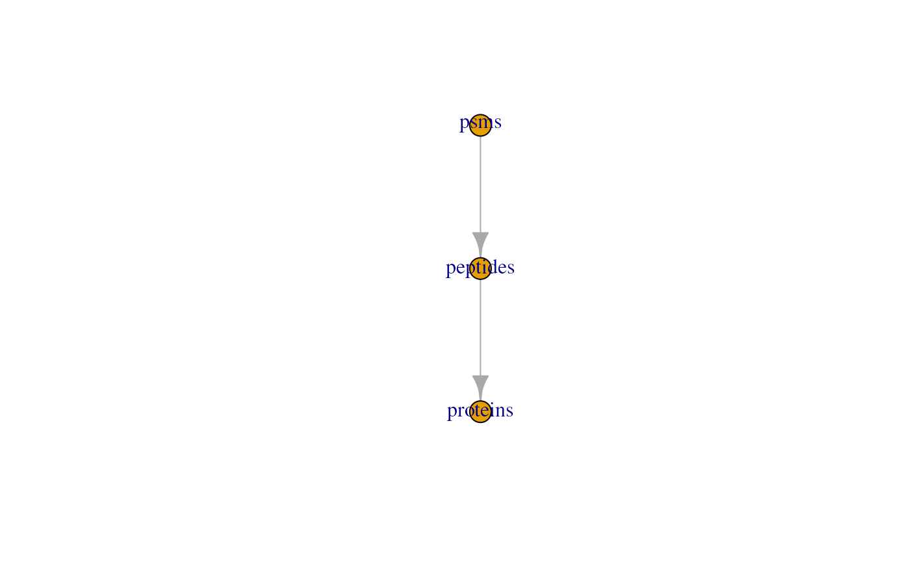
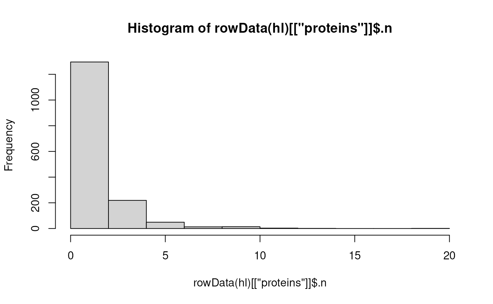
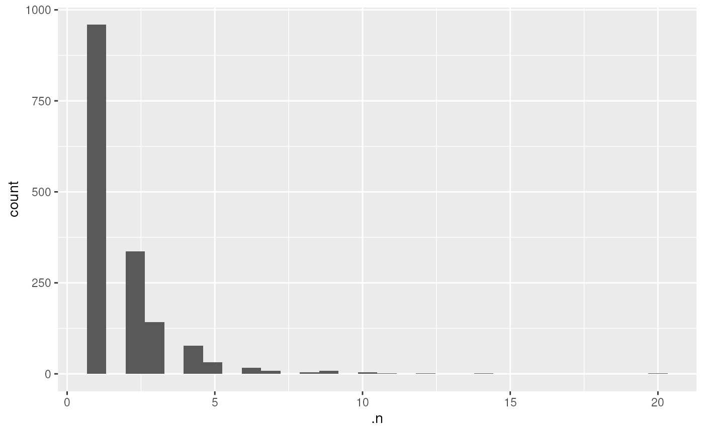

# Data visualization from a QFeatures object

Abstract

This vignette describes how to visualize quantitative mass spectrometry
data contained in a QFeatures object. This vignette is distributed under
a CC BY-SA license.

## Preparing the data

To demonstrate the data visualization of `QFeatures`, we first perform a
quick processing of the `hlpsms` example data. We load the data and read
it as a `QFeautres` object. See the processing
[vignette](https://rformassspectrometry.github.io/QFeatures/articles/Processing.html)
for more details about data processing with `QFeatures`.

``` r

library("QFeatures")
data(hlpsms)
hl <- readQFeatures(hlpsms, quantCols = 1:10, name = "psms")
```

We then aggregate the psms to peptides, and the peptodes to proteins.

``` r

hl <- aggregateFeatures(hl, "psms", "Sequence", name = "peptides", fun = colMeans)
```

    ## Your row data contain missing values. Please read the relevant
    ## section(s) in the aggregateFeatures manual page regarding the effects
    ## of missing values on data aggregation.

    ## Aggregated: 1/1

``` r

hl <- aggregateFeatures(hl, "peptides", "ProteinGroupAccessions", name = "proteins", fun = colMeans)
```

    ## Aggregated: 1/1

We also add the TMT tags that were used to multiplex the samples. The
data is added to the `colData` of the `QFeatures` object and will allow
us to demonstrate how to plot data from the `colData`.

``` r

hl$tag <- c("126", "127N", "127C", "128N", "128C", "129N", "129C",
            "130N", "130C", "131")
```

The dataset is now ready for data exploration.

## Exploring the `QFeatures` hierarchy

`QFeatures` objects can contain several assays as the data goes through
the processing workflow. The `plot` function provides an overview of all
the assays present in the dataset, showing also the hierarchical
relationships between the assays as determined by the `AssayLinks`.

``` r

plot(hl)
```



This plot is rather simple with only three assays, but some processing
workflows may involve more steps. The `feat3` example data illustrates
the different possible relationships: one parent to one child, multiple
parents to one child and one parent to multiple children.

``` r

data("feat3")
plot(feat3)
```


Note that some datasets may contain many assays, for instance because
the MS experiment consists of hundreds of batches. This can lead to an
overcrowded plot. Therefore, you can also explore this hierarchy of
assays through an interactive plot, supported by the `plotly` package
(Sievert (2020)). You can use the viewer panel to zoom in and out and
navigate across the tree(s).

``` r

plot(hl, interactive = TRUE)
```

## Basic data exploration

The quantitative data is retrieved using `assay()`, the feature metadata
is retrieved using `rowData()` on the assay of interest, and the sample
metadata is retrieved using `colData()`. Once retrieved, the data can be
supplied to the base R data exploration tools. Here are some examples:

- Plot the intensities for the first protein. These data are available
  from the `proteins` assay.

``` r

plot(assay(hl, "proteins")[1, ])
```


- Get the distribution of the number of peptides that were aggregated
  per protein. These data are available in the column `.n` from the
  protein `rowData`.

``` r

hist(rowData(hl)[["proteins"]]$.n)
```



- Get the count table of the different tags used for labeling the
  samples. These data are available in the column `tag` from the
  `colData`.

``` r

table(hl$tag)
```

    ## 
    ##  126 127C 127N 128C 128N 129C 129N 130C 130N  131 
    ##    1    1    1    1    1    1    1    1    1    1

## Using `ggplot2`

`ggplot2` is a powerful tool for data visualization in `R` and is part
of the `tidyverse` package ecosystem (Wickham et al. (2019)). It
produces elegant and publication-ready plots in a few lines of code.
`ggplot2` can be used to explore `QFeatures` object, similarly to the
base functions shown above. Note that `ggplot2` expects `data.frame` or
`tibble` objects whereas the quantitative data in `QFeatures` are
encoded as `matrix` (or matrix-like objects, see
`?SummarizedExperiment`) and the `rowData` and `colData` are encoded as
`DataFrame`. This is easily circumvented by converting those objects to
`data.frame`s or `tibble`s. See here how we reproduce the plot above
using `ggplot2`.

``` r

library("ggplot2")
df <- data.frame(rowData(hl)[["proteins"]])
ggplot(df) +
    aes(x = .n) +
    geom_histogram()
```



We refer the reader to the `ggplot2` [package
website](https://ggplot2.tidyverse.org/) for more information about the
wide variety of functions that the package offers and for tutorials and
cheatsheets.

Another useful package for quantitative data exploration is
`ComplexHeatmap` (Gu et al. (2016)). It is part of the Bioconductor
project (Gentleman et al. (2004)) and facilitates visualization of
matrix objects as heatmap. See here an example where we plot the protein
data.

``` r

library(ComplexHeatmap)
Heatmap(matrix = assay(hl, "proteins"),
        show_row_names = FALSE)
```


`ComplexHeatmap` also allows to add row and/or column annotations. Let’s
add the predicted protein location as row annotation.

``` r

ha <- rowAnnotation(markers = rowData(hl)[["proteins"]]$markers)
Heatmap(matrix = assay(hl, "proteins"),
        show_row_names = FALSE,
        left_annotation = ha)
```


More advanced usage of `ComplexHeatmap` is described in the package
reference
[book](https://jokergoo.github.io/ComplexHeatmap-reference/book/).

## Advanced data exploration

In this section, we show how to combine in a single table different
pieces of information available in a `QFeatures` object, that are
quantitation data, feature metadata and sample metadata. The `QFeatures`
package provides the
[`longForm()`](https://rformassspectrometry.github.io/QFeatures/reference/QFeatures-longForm.md)
function that converts a `QFeatures` object into a long table. Long
tables are very useful when using `ggplot2` for data visualization. For
instance, suppose we want to visualize the distribution of protein
quantitation (present in the `proteins` assay) with respect to the
different acquisition tags (present in the `colData`) for each predicted
cell location separately (present in the `rowData` of the assays).
Furthermore, we link the quantitation values coming from the same
protein using lines. This can all be plotted at once in a few lines of
code.

``` r

lf <- longForm(hl[, , "proteins"],
               rowvars = "markers",
               colvars = "tag")
```

    ## Warning: 'experiments' dropped; see 'drops()'

    ## harmonizing input:
    ##   removing 20 sampleMap rows not in names(experiments)

``` r

ggplot(data.frame(lf)) +
    aes(x = tag,
        y = value,
        group = rowname) +
    geom_line() +
    facet_wrap(~ markers, scales = "free_y", ncol = 3)
```


[`longForm()`](https://rformassspectrometry.github.io/QFeatures/reference/QFeatures-longForm.md)
allows to retrieve and combine all available data from a `Qfeatures`
object. We here demonstrate the ease to combine different pieces that
could highlight sample specific and/or feature specific effects on data
quantitation.

## Interactive data exploration

Finally, a simply `shiny` app allows to explore and visualise the
respective assays of a `QFeatures` object.

``` r

display(hl)
```


`QFeatures` interactive interface: heatmap of the peptide assay data.


`QFeatures` interactive interface: quantitative peptide assay data.


`QFeatures` interactive interface: peptide assay row data

A dropdown menu in the side bar allows the user to select an assay of
interest, which can then be visualised as a heatmap (figure
@ref(fig:heatmapdisplay)), as a quantitative table (figure
@ref(fig:assaydisplay)) or a row data table (figure
@ref(fig:rowdatadisplay)).

## Session information

    ## R version 4.5.1 (2025-06-13)
    ## Platform: x86_64-pc-linux-gnu
    ## Running under: Ubuntu 24.04.3 LTS
    ## 
    ## Matrix products: default
    ## BLAS:   /usr/lib/x86_64-linux-gnu/openblas-pthread/libblas.so.3 
    ## LAPACK: /usr/lib/x86_64-linux-gnu/openblas-pthread/libopenblasp-r0.3.26.so;  LAPACK version 3.12.0
    ## 
    ## locale:
    ##  [1] LC_CTYPE=en_US.UTF-8       LC_NUMERIC=C              
    ##  [3] LC_TIME=en_US.UTF-8        LC_COLLATE=en_US.UTF-8    
    ##  [5] LC_MONETARY=en_US.UTF-8    LC_MESSAGES=en_US.UTF-8   
    ##  [7] LC_PAPER=en_US.UTF-8       LC_NAME=C                 
    ##  [9] LC_ADDRESS=C               LC_TELEPHONE=C            
    ## [11] LC_MEASUREMENT=en_US.UTF-8 LC_IDENTIFICATION=C       
    ## 
    ## time zone: UTC
    ## tzcode source: system (glibc)
    ## 
    ## attached base packages:
    ## [1] grid      stats4    stats     graphics  grDevices utils     datasets 
    ## [8] methods   base     
    ## 
    ## other attached packages:
    ##  [1] ComplexHeatmap_2.25.2       ggplot2_4.0.0              
    ##  [3] QFeatures_1.19.3            MultiAssayExperiment_1.35.9
    ##  [5] SummarizedExperiment_1.39.2 Biobase_2.69.1             
    ##  [7] GenomicRanges_1.61.5        Seqinfo_0.99.2             
    ##  [9] IRanges_2.43.5              S4Vectors_0.47.4           
    ## [11] BiocGenerics_0.55.4         generics_0.1.4             
    ## [13] MatrixGenerics_1.21.0       matrixStats_1.5.0          
    ## [15] BiocStyle_2.37.1           
    ## 
    ## loaded via a namespace (and not attached):
    ##  [1] tidyselect_1.2.1        dplyr_1.1.4             farver_2.1.2           
    ##  [4] S7_0.2.0                fastmap_1.2.0           lazyeval_0.2.2         
    ##  [7] digest_0.6.37           lifecycle_1.0.4         cluster_2.1.8.1        
    ## [10] ProtGenerics_1.41.0     magrittr_2.0.4          compiler_4.5.1         
    ## [13] rlang_1.1.6             sass_0.4.10             tools_4.5.1            
    ## [16] igraph_2.2.0            yaml_2.3.10             knitr_1.50             
    ## [19] S4Arrays_1.9.1          labeling_0.4.3          htmlwidgets_1.6.4      
    ## [22] DelayedArray_0.35.3     plyr_1.8.9              RColorBrewer_1.1-3     
    ## [25] abind_1.4-8             withr_3.0.2             purrr_1.1.0            
    ## [28] desc_1.4.3              colorspace_2.1-2        scales_1.4.0           
    ## [31] iterators_1.0.14        MASS_7.3-65             cli_3.6.5              
    ## [34] rmarkdown_2.30          crayon_1.5.3            ragg_1.5.0             
    ## [37] rjson_0.2.23            reshape2_1.4.4          BiocBaseUtils_1.11.2   
    ## [40] cachem_1.1.0            stringr_1.5.2           parallel_4.5.1         
    ## [43] AnnotationFilter_1.33.0 BiocManager_1.30.26     XVector_0.49.1         
    ## [46] vctrs_0.6.5             Matrix_1.7-4            jsonlite_2.0.0         
    ## [49] bookdown_0.45           GetoptLong_1.0.5        clue_0.3-66            
    ## [52] magick_2.9.0            systemfonts_1.3.1       foreach_1.5.2          
    ## [55] tidyr_1.3.1             jquerylib_0.1.4         glue_1.8.0             
    ## [58] pkgdown_2.1.3.9000      codetools_0.2-20        shape_1.4.6.1          
    ## [61] stringi_1.8.7           gtable_0.3.6            tibble_3.3.0           
    ## [64] pillar_1.11.1           htmltools_0.5.8.1       circlize_0.4.16        
    ## [67] R6_2.6.1                textshaping_1.0.4       doParallel_1.0.17      
    ## [70] evaluate_1.0.5          lattice_0.22-7          png_0.1-8              
    ## [73] bslib_0.9.0             Rcpp_1.1.0              SparseArray_1.9.1      
    ## [76] xfun_0.53               MsCoreUtils_1.21.0      fs_1.6.6               
    ## [79] pkgconfig_2.0.3         GlobalOptions_0.1.2

## License

This vignette is distributed under a [CC BY-SA
license](https://creativecommons.org/licenses/by-sa/2.0/) license.

## References

Gentleman, Robert C., Vincent J. Carey, Douglas M. Bates, et al. 2004.
“Bioconductor: Open Software Development for Computational Biology and
Bioinformatics.” *Genome Biol* 5 (10): –80.
<https://doi.org/10.1186/gb-2004-5-10-r80>.

Gu, Zuguang, Roland Eils, and Matthias Schlesner. 2016. “Complex
Heatmaps Reveal Patterns and Correlations in Multidimensional Genomic
Data.” *Bioinformatics* 32 (18): 2847–49.

Sievert, Carson. 2020. *Interactive Web-Based Data Visualization with r,
Plotly, and Shiny*. Chapman; Hall/CRC. <https://plotly-r.com>.

Wickham, Hadley, Mara Averick, Jennifer Bryan, et al. 2019. “Welcome to
the Tidyverse.” *J. Open Source Softw.* 4 (43): 1686.
