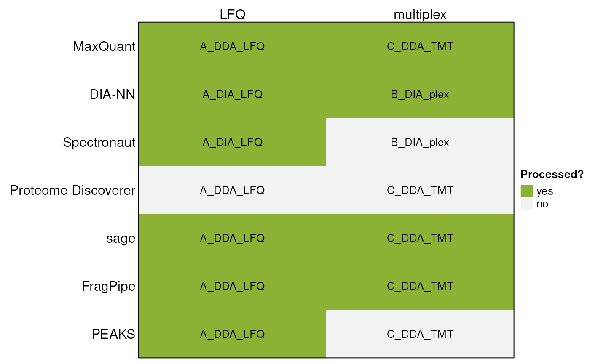

# Supported input formats for readQFeatures()

## Methods

### Datasets

This vignette demonstrates the use of the *QFeatures* package’s
[`readQFeatures()`](https://rformassspectrometry.github.io/QFeatures/reference/readQFeatures.md)
function to import data produced by popular third-party software. For
this purpose, subsets of the following previously publicly available
datasets have been used:

| Citation                  | PXD ID    | Mode | Label   | Code       |
|---------------------------|-----------|------|---------|------------|
| Van Puyvelde et al., 2022 | PXD028735 | DIA  | LFQ     | A_DIA_LFQ  |
|                           |           | DDA  | LFQ     | A_DDA_LFQ  |
| Derks et al., 2022        | PXD029531 | DIA  | plexDIA | B_DIA_plex |
| Christoforou et al., 2016 | PXD001279 | DDA  | TMT     | C_DDA_TMT  |

Specifically, these subsets consist of these files:

|            |                                                       |
|------------|-------------------------------------------------------|
| Code       | Original raw file name                                |
| A_DIA_LFQ  | LFQ_timsTOFPro_diaPASEF_Condition_A_Sample_Alpha_01.d |
|            | LFQ_timsTOFPro_diaPASEF_Condition_A_Sample_Alpha_02.d |
|            | LFQ_timsTOFPro_diaPASEF_Condition_A_Sample_Alpha_03.d |
|            | LFQ_timsTOFPro_diaPASEF_Condition_B_Sample_Alpha_01.d |
|            | LFQ_timsTOFPro_diaPASEF_Condition_B_Sample_Alpha_02.d |
|            | LFQ_timsTOFPro_diaPASEF_Condition_B_Sample_Alpha_03.d |
| A_DDA_LFQ  | LFQ_Orbitrap_DDA_Condition_A_Sample_Alpha_01.raw      |
|            | LFQ_Orbitrap_DDA_Condition_A_Sample_Alpha_02.raw      |
|            | LFQ_Orbitrap_DDA_Condition_A_Sample_Alpha_03.raw      |
|            | LFQ_Orbitrap_DDA_Condition_B_Sample_Alpha_01.raw      |
|            | LFQ_Orbitrap_DDA_Condition_B_Sample_Alpha_02.raw      |
|            | LFQ_Orbitrap_DDA_Condition_B_Sample_Alpha_03.raw      |
| B_DIA_plex | wJD803.raw                                            |
|            | wJD804.raw                                            |
|            | wJD815.raw                                            |
| C_DDA_TMT  | Replicate1_fraction1.raw                              |
|            | Replicate1_fraction2.raw                              |

Identifications and quantifications performed on these datasets were
used in combination with the following software:



The data files are available in the `MsDataHub` package (\>= 1.11.5).

``` r

library("MsDataHub")
MsDataHub() |>
    dplyr::filter(grepl("19137577", SourceUrl)) |>
    dplyr::pull(Title)
```

    ##  [1] "Christoforou_2016_TMT_DDA_FragPipe_Fraction1_psm.tsv"
    ##  [2] "Christoforou_2016_TMT_DDA_FragPipe_Fraction2_psm.tsv"
    ##  [3] "Christoforou_2016_TMT_DDA_MaxQuant_evidence.txt"     
    ##  [4] "Christoforou_2016_TMT_DDA_sage_results.sage.tsv"     
    ##  [5] "Christoforou_2016_TMT_DDA_sage_tmt.tsv"              
    ##  [6] "Derks_2022_plex_DIA_DIANN_report_subset.tsv"         
    ##  [7] "vanPuyvelde_2022_LFQ_DDA_FragPipe_A_1_psm.tsv"       
    ##  [8] "vanPuyvelde_2022_LFQ_DDA_FragPipe_A_2_psm.tsv"       
    ##  [9] "vanPuyvelde_2022_LFQ_DDA_FragPipe_A_3_psm.tsv"       
    ## [10] "vanPuyvelde_2022_LFQ_DDA_FragPipe_B_1_psm.tsv"       
    ## [11] "vanPuyvelde_2022_LFQ_DDA_FragPipe_B_2_psm.tsv"       
    ## [12] "vanPuyvelde_2022_LFQ_DDA_FragPipe_B_3_psm.tsv"       
    ## [13] "vanPuyvelde_2022_LFQ_DDA_MaxQuant_evidence.txt"      
    ## [14] "vanPuyvelde_2022_LFQ_DDA_MaxQuant_peptides.txt"      
    ## [15] "vanPuyvelde_2022_LFQ_DDA_MaxQuant_proteinGroups.txt" 
    ## [16] "vanPuyvelde_2022_LFQ_DDA_PEAKS_LFQ_report.csv"       
    ## [17] "vanPuyvelde_2022_LFQ_DDA_sage_lfq.tsv"               
    ## [18] "vanPuyvelde_2022_LFQ_DDA_sage_results.sage.tsv"      
    ## [19] "vanPuyvelde_2022_LFQ_DIA_DIANN_report.parquet"       
    ## [20] "vanPuyvelde_2022_LFQ_DIA_DIANN_report.tsv"

Each file can be accessed with the function that has its name:

``` r

vanPuyvelde_2022_LFQ_DDA_FragPipe_A_2_psm.tsv()
```

    ## see ?MsDataHub and browseVignettes('MsDataHub') for documentation

    ## loading from cache

    ##                                                 EH10423 
    ## "/github/home/.cache/R/ExperimentHub/cb11fef3168_10490"

``` r

Derks_2022_plex_DIA_DIANN_report_subset.tsv()
```

    ## see ?MsDataHub and browseVignettes('MsDataHub') for documentation
    ## loading from cache

    ##                                                 EH10421 
    ## "/github/home/.cache/R/ExperimentHub/cb1480d8954_10488"

and imported as a standard `data.frame` using the usual `read.*()`
functions (see below).

### Existing search outputs

Example outputs for LFQ quantification using DIA-NN, Spectronaut and
PEAKS were sourced from the ProteoBench website. IDs of these outputs on
the ProteoBench website are as follows:

- DIA-NN:
  - DIA-NN_20250714_074145 (.parquet output)
  - DIA-NN_20250606_103313 (.tsv output)
- Spectronaut:
  - Spectronaut_20250609_135453
- PEAKS:
  - PEAKS_20250714_150458

As an example output for multiplex quantification using DIA-NN, a search
result of the plexDIA dataset was sourced from the MassIVE repository
(MSV000088302).

### New search outputs

Following software versions were used to produce search results used in
this vignette:

- MaxQuant 2.7.0
- sage 0.14.7
- FragPipe 23.1

## Introduction

Below, we describe individual outputs and their processing using the
[`readQFeatures()`](https://rformassspectrometry.github.io/QFeatures/reference/readQFeatures.md)
functions. When applicable, we demonstrate how to read data on PSM,
precursor, as well as protein group level.

For general explanation of the `QFeatures` class and detailed
description of individual arguments taken by the
[`readQFeatures()`](https://rformassspectrometry.github.io/QFeatures/reference/readQFeatures.md)
group of functions, consult the
[`readQFeatures()`](https://rformassspectrometry.github.io/QFeatures/reference/readQFeatures.md)
manual page of this
[vignette](https://rformassspectrometry.github.io/QFeatures/articles/readQFeatures.html).

To initiate the session, we will load the `QFeatures` package.

``` r

library(QFeatures)
```

## MaxQuant

MaxQuant produces several output `.txt` files. In order to obtain
information from several levels of the search, we can look at the
`evidence.txt`, `peptides.txt` and `proteinGroups.txt` files.

### Label-free

Here we will process the results of a multi-set label-free experiment.
First we will read the `evidence.txt` file storing information about
PSM-level data:

``` r

dataMaxquantLFQevidence <-
    vanPuyvelde_2022_LFQ_DDA_MaxQuant_evidence.txt() |>
    read.delim()

nrow(dataMaxquantLFQevidence)
```

    ## [1] 1219

We can now import the data.frame as a `QFeatures` object using
`"Intensity"` as quantitative column. This column the quantitation
values of all samples, acquired in different runs, as defined in the
`"Experiment"` column. We also rename the set names, prefixing them with
`"psm_"`.

``` r

qfMaxquant <- readQFeatures(dataMaxquantLFQevidence,
                            quantCols = "Intensity",
                            runCol = "Experiment")
```

    ##   |                                                                              |                                                                      |   0%  |                                                                              |============                                                          |  17%  |                                                                              |=======================                                               |  33%  |                                                                              |===================================                                   |  50%  |                                                                              |===============================================                       |  67%  |                                                                              |==========================================================            |  83%  |                                                                              |======================================================================| 100%

``` r

names(qfMaxquant) <- paste('psm', names(qfMaxquant), sep = '_')

qfMaxquant
```

    ## An instance of class QFeatures (type: bulk) with 6 sets:
    ## 
    ##  [1] psm_A_Sample_Alpha_01: SummarizedExperiment with 224 rows and 1 columns 
    ##  [2] psm_A_Sample_Alpha_02: SummarizedExperiment with 227 rows and 1 columns 
    ##  [3] psm_A_Sample_Alpha_03: SummarizedExperiment with 222 rows and 1 columns 
    ##  [4] psm_B_Sample_Alpha_01: SummarizedExperiment with 185 rows and 1 columns 
    ##  [5] psm_B_Sample_Alpha_02: SummarizedExperiment with 172 rows and 1 columns 
    ##  [6] psm_B_Sample_Alpha_03: SummarizedExperiment with 189 rows and 1 columns

Next we will read the peptide-level results from a `peptides.txt` file
and append this to the `QFeatures` object as a new assay:

``` r

dataMaxquantLFQpeptide <-
    vanPuyvelde_2022_LFQ_DDA_MaxQuant_peptides.txt() |>
    read.delim()
nrow(dataMaxquantLFQpeptide)
```

    ## [1] 260

This table is in a large format, meaning that the peptide quantitation
values of different samples are stored in different columns. We thus get
the indices of respective intensity columns, starting with
`"Intensity."`.

``` r

(i <- grep('Intensity.', colnames(dataMaxquantLFQpeptide), fixed = TRUE))
```

    ## [1] 53 54 55 56 57 58

``` r

colnames(dataMaxquantLFQpeptide)[i]
```

    ## [1] "Intensity.A_Sample_Alpha_01" "Intensity.A_Sample_Alpha_02"
    ## [3] "Intensity.A_Sample_Alpha_03" "Intensity.B_Sample_Alpha_01"
    ## [5] "Intensity.B_Sample_Alpha_02" "Intensity.B_Sample_Alpha_03"

We can read this peptide-level table as a new `QFeatures` object using
the same
[`readQFeatures()`](https://rformassspectrometry.github.io/QFeatures/reference/readQFeatures.md)
as above. This time, it will contain a single set with as many columns
as there are samples/acquisitions in the data.

``` r

readQFeatures(dataMaxquantLFQpeptide, quantCols = i, fnames = 'Sequence')
```

    ## An instance of class QFeatures (type: bulk) with 1 set:
    ## 
    ##  [1] quants: SummarizedExperiment with 260 rows and 6 columns

If we want to add the peptide-level data to our previously created
`QFeatures` object, we can read it as an invidual set (a
`SummarizedExperiment` instance) and add it with
[`addAssay()`](https://rformassspectrometry.github.io/QFeatures/reference/QFeatures-class.md)

``` r

pepSE <- readSummarizedExperiment(dataMaxquantLFQpeptide,
                                  quantCols = i,
                                  fnames = 'Sequence')
pepSE
```

    ## class: SummarizedExperiment 
    ## dim: 260 6 
    ## metadata(0):
    ## assays(1): ''
    ## rownames(260): GAGSSEPVTGLDAK VEATFGVDESNAK ... VMALELGPHK
    ##   VNAVNPTVVMTSMGQATWSDPHK
    ## rowData names(65): Sequence N.term.cleavage.window ... Mass.deficit
    ##   MS.MS.Count
    ## colnames(6): Intensity.A_Sample_Alpha_01 Intensity.A_Sample_Alpha_02
    ##   ... Intensity.B_Sample_Alpha_02 Intensity.B_Sample_Alpha_03
    ## colData names(0):

``` r

qfMaxquant <- addAssay(qfMaxquant,
                      pepSE,
                      name = 'peptides')
qfMaxquant
```

    ## An instance of class QFeatures (type: bulk) with 7 sets:
    ## 
    ##  [1] psm_A_Sample_Alpha_01: SummarizedExperiment with 224 rows and 1 columns 
    ##  [2] psm_A_Sample_Alpha_02: SummarizedExperiment with 227 rows and 1 columns 
    ##  [3] psm_A_Sample_Alpha_03: SummarizedExperiment with 222 rows and 1 columns 
    ##  [4] psm_B_Sample_Alpha_01: SummarizedExperiment with 185 rows and 1 columns 
    ##  [5] psm_B_Sample_Alpha_02: SummarizedExperiment with 172 rows and 1 columns 
    ##  [6] psm_B_Sample_Alpha_03: SummarizedExperiment with 189 rows and 1 columns 
    ##  [7] peptides: SummarizedExperiment with 260 rows and 6 columns

We see that a new assay has been appended to `QFeatures` object.

Finally, we will append the protein group-level in the same manner. Here
we will use the `"LFQ.intensity"` columns:

``` r

dataMaxquantLFQprotein <-
    vanPuyvelde_2022_LFQ_DDA_MaxQuant_proteinGroups.txt() |>
    read.delim()
nrow(dataMaxquantLFQprotein)
```

    ## [1] 40

``` r

## get indices of LFQ intensity columns
(i <- grep('LFQ.intensity.', colnames(dataMaxquantLFQprotein),
           fixed = TRUE))
```

    ## [1] 52 53 54 55 56 57

``` r

colnames(dataMaxquantLFQprotein)[i]
```

    ## [1] "LFQ.intensity.A_Sample_Alpha_01" "LFQ.intensity.A_Sample_Alpha_02"
    ## [3] "LFQ.intensity.A_Sample_Alpha_03" "LFQ.intensity.B_Sample_Alpha_01"
    ## [5] "LFQ.intensity.B_Sample_Alpha_02" "LFQ.intensity.B_Sample_Alpha_03"

``` r

## load the data
protSE <- readSummarizedExperiment(dataMaxquantLFQprotein,
                                   quantCols = i,
                                   fnames = 'Protein.IDs')
protSE
```

    ## class: SummarizedExperiment 
    ## dim: 40 6 
    ## metadata(0):
    ## assays(1): ''
    ## rownames(40): iRT-b-cRAP iRT-c-cRAP ... P07149 Q7Z4W1
    ## rowData names(73): Protein.IDs Majority.protein.IDs ... Taxonomy.IDs
    ##   Taxonomy.names
    ## colnames(6): LFQ.intensity.A_Sample_Alpha_01
    ##   LFQ.intensity.A_Sample_Alpha_02 ... LFQ.intensity.B_Sample_Alpha_02
    ##   LFQ.intensity.B_Sample_Alpha_03
    ## colData names(0):

``` r

qfMaxquant <- addAssay(qfMaxquant,
                       protSE,
                       name = 'proteinGroups')
qfMaxquant
```

    ## An instance of class QFeatures (type: bulk) with 8 sets:
    ## 
    ##  [1] psm_A_Sample_Alpha_01: SummarizedExperiment with 224 rows and 1 columns 
    ##  [2] psm_A_Sample_Alpha_02: SummarizedExperiment with 227 rows and 1 columns 
    ##  [3] psm_A_Sample_Alpha_03: SummarizedExperiment with 222 rows and 1 columns 
    ##  ...
    ##  [6] psm_B_Sample_Alpha_03: SummarizedExperiment with 189 rows and 1 columns 
    ##  [7] peptides: SummarizedExperiment with 260 rows and 6 columns 
    ##  [8] proteinGroups: SummarizedExperiment with 40 rows and 6 columns

It is important to highlight however that, while it is possible to add
PSM-, peptide- and protein-level sets one-by-one, as illustrated above,
we strongly recommend to compute the peptide-level data from the
PSM-level data, and the protein-level data from the peptide-level data
using the
[`QFeatures::aggregateFeatures()`](https://rformassspectrometry.github.io/QFeatures/reference/QFeatures-aggregate.md)
function. The function will record the link between features, PSM to
peptide and peptides to protein, and consistently apply filtering across
these levels. Alternatively, these links between sets can be re-computer
with the
[`addAssayLink()`](https://rformassspectrometry.github.io/QFeatures/reference/AssayLinks.md)
function.

### TMT

Below, we will demonstrate how to read data from a TMT-labeled
experiment consisting of two runs:

``` r

dataMaxquantTMTevidence <-
    Christoforou_2016_TMT_DDA_MaxQuant_evidence.txt() |>
    read.delim()

(i <- grep('Reporter.intensity.\\d+', colnames(dataMaxquantTMTevidence)))
```

    ##  [1] 73 74 75 76 77 78 79 80 81 82

``` r

colnames(dataMaxquantTMTevidence)[i]
```

    ##  [1] "Reporter.intensity.1"  "Reporter.intensity.2"  "Reporter.intensity.3" 
    ##  [4] "Reporter.intensity.4"  "Reporter.intensity.5"  "Reporter.intensity.6" 
    ##  [7] "Reporter.intensity.7"  "Reporter.intensity.8"  "Reporter.intensity.9" 
    ## [10] "Reporter.intensity.10"

``` r

qfMaxquantTMT <- readQFeatures(dataMaxquantTMTevidence,
                               quantCols = i,
                               runCol = 'Raw.file',
                               fnames = 'Sequence')
```

    ##   |                                                                              |                                                                      |   0%  |                                                                              |===================================                                   |  50%  |                                                                              |======================================================================| 100%

    ## Warning in FUN(X[[i]], ...): Duplicated entries found in 'Sequence' in rowData
    ## of assay Replicate1_fraction1; they are made unique.

    ## Warning in FUN(X[[i]], ...): Duplicated entries found in 'Sequence' in rowData
    ## of assay Replicate1_fraction2; they are made unique.

``` r

qfMaxquantTMT
```

    ## An instance of class QFeatures (type: bulk) with 2 sets:
    ## 
    ##  [1] Replicate1_fraction1: SummarizedExperiment with 47 rows and 10 columns 
    ##  [2] Replicate1_fraction2: SummarizedExperiment with 77 rows and 10 columns

We see that a separate experiment has been created for each run with 10
columns corresponding to the 10 TMT channels.

## DIA-NN

### Label-free

DIA-NN versions 1.9.0 and below produce a main *.tsv* search result
file, which has been replaced by a *.parquet* file from version 2.0.0 up
solely .

DIA-NN *.tsv* reports can be read using the
[`readQFeaturesFromDIANN()`](https://rformassspectrometry.github.io/QFeatures/reference/readQFeaturesFromDIANN.md)
function:

``` r

qfDiannLFQ <-
    vanPuyvelde_2022_LFQ_DIA_DIANN_report.tsv() |>
    read.delim() |>
    readQFeaturesFromDIANN(runCol = 'Run')
```

    ##   |                                                                              |                                                                      |   0%  |                                                                              |============                                                          |  17%  |                                                                              |=======================                                               |  33%  |                                                                              |===================================                                   |  50%  |                                                                              |===============================================                       |  67%  |                                                                              |==========================================================            |  83%  |                                                                              |======================================================================| 100%

``` r

qfDiannLFQ
```

    ## An instance of class QFeatures (type: bulk) with 6 sets:
    ## 
    ##  [1] ttSCP_diaPASEF_Condition_A_Sample_Alpha_01_11494: SummarizedExperiment with 393 rows and 1 columns 
    ##  [2] ttSCP_diaPASEF_Condition_A_Sample_Alpha_02_11500: SummarizedExperiment with 394 rows and 1 columns 
    ##  [3] ttSCP_diaPASEF_Condition_A_Sample_Alpha_03_11506: SummarizedExperiment with 391 rows and 1 columns 
    ##  [4] ttSCP_diaPASEF_Condition_B_Sample_Alpha_01_11496: SummarizedExperiment with 382 rows and 1 columns 
    ##  [5] ttSCP_diaPASEF_Condition_B_Sample_Alpha_02_11502: SummarizedExperiment with 378 rows and 1 columns 
    ##  [6] ttSCP_diaPASEF_Condition_B_Sample_Alpha_03_11508: SummarizedExperiment with 381 rows and 1 columns

In order to read a *.parquet* file in R, we need to use the `arrow`
package, that provides an interface to the Arrow C++ library. After
reading this file however, we can work with the resulting data.frame in
the same manner as we are used to in case of the *.tsv* report.

``` r

qfDiannParquet <-
    vanPuyvelde_2022_LFQ_DIA_DIANN_report.parquet() |>
    arrow::read_parquet() |>
    readQFeaturesFromDIANN(runCol = 'Run')
```

    ##   |                                                                              |                                                                      |   0%  |                                                                              |============                                                          |  17%  |                                                                              |=======================                                               |  33%  |                                                                              |===================================                                   |  50%  |                                                                              |===============================================                       |  67%  |                                                                              |==========================================================            |  83%  |                                                                              |======================================================================| 100%

``` r

qfDiannParquet
```

    ## An instance of class QFeatures (type: bulk) with 6 sets:
    ## 
    ##  [1] ttSCP_diaPASEF_Condition_A_Sample_Alpha_01_11494: SummarizedExperiment with 422 rows and 1 columns 
    ##  [2] ttSCP_diaPASEF_Condition_A_Sample_Alpha_02_11500: SummarizedExperiment with 426 rows and 1 columns 
    ##  [3] ttSCP_diaPASEF_Condition_A_Sample_Alpha_03_11506: SummarizedExperiment with 422 rows and 1 columns 
    ##  [4] ttSCP_diaPASEF_Condition_B_Sample_Alpha_01_11496: SummarizedExperiment with 408 rows and 1 columns 
    ##  [5] ttSCP_diaPASEF_Condition_B_Sample_Alpha_02_11502: SummarizedExperiment with 409 rows and 1 columns 
    ##  [6] ttSCP_diaPASEF_Condition_B_Sample_Alpha_03_11508: SummarizedExperiment with 416 rows and 1 columns

As you can see, both experiments consist of the same run names as both
searches have been performed on the same set of raw data. The numbers of
rows in each `SummarizedExperiment` however differ between those two
reports, as both searches have been performed using different software
versions, as well as different search parameters.

### plexDIA

To correctly parse a plexDIA experiment, it is necessary to set the
`multiplexing` parameter to `"mTRAQ"`:

``` r

qfDiannPlex <-
    Derks_2022_plex_DIA_DIANN_report_subset.tsv() |>
    read.delim() |>
    readQFeaturesFromDIANN(runCol = 'Run',
                           multiplexing = 'mTRAQ')
```

    ##   |                                                                              |                                                                      |   0%  |                                                                              |=======================                                               |  33%  |                                                                              |===============================================                       |  67%  |                                                                              |======================================================================| 100%

``` r

qfDiannPlex
```

    ## An instance of class QFeatures (type: bulk) with 3 sets:
    ## 
    ##  [1] eJD905: SummarizedExperiment with 65 rows and 3 columns 
    ##  [2] eJD906: SummarizedExperiment with 66 rows and 3 columns 
    ##  [3] eJD907: SummarizedExperiment with 75 rows and 3 columns

The run names in this output file are not the most informative with
regards to the samples. We will now edit the sample metadata to contain
more meaningful sample annotation. All runs were performed on the same
sample, in 3 technical replicates:

``` r

qfDiannPlex$sample <- 'mixed standard'
qfDiannPlex$rep <- rep(1:3, each = 3)
qfDiannPlex$label <- paste0('mTraq d', rep(c(0, 4, 8), times = 3))
colData(qfDiannPlex)
```

    ## DataFrame with 9 rows and 3 columns
    ##                 sample       rep       label
    ##            <character> <integer> <character>
    ## eJD905_0 mixed stan...         1    mTraq d0
    ## eJD905_4 mixed stan...         1    mTraq d4
    ## eJD905_8 mixed stan...         1    mTraq d8
    ## eJD906_0 mixed stan...         2    mTraq d0
    ## eJD906_4 mixed stan...         2    mTraq d4
    ## eJD906_8 mixed stan...         2    mTraq d8
    ## eJD907_0 mixed stan...         3    mTraq d0
    ## eJD907_4 mixed stan...         3    mTraq d4
    ## eJD907_8 mixed stan...         3    mTraq d8

## sage

The **sage** search engine stores quantification data either in the
*lfq.tsv* or *tmt.tsv* file based on the quantification used.

As above for label-free quantification, the *lfq.tsv* file contains
estimated quantities of identified peptidoforms and is grouped on
modified sequence level:

``` r

dataSageLFQ <-
    vanPuyvelde_2022_LFQ_DDA_sage_lfq.tsv() |>
    read.delim()

(i <- grep('.mzML', colnames(dataSageLFQ), fixed = TRUE))
```

    ## [1]  7  8  9 10 11 12

``` r

colnames(dataSageLFQ)[i]
```

    ## [1] "LFQ_Orbitrap_DDA_Condition_A_Sample_Alpha_01.mzML"
    ## [2] "LFQ_Orbitrap_DDA_Condition_A_Sample_Alpha_02.mzML"
    ## [3] "LFQ_Orbitrap_DDA_Condition_A_Sample_Alpha_03.mzML"
    ## [4] "LFQ_Orbitrap_DDA_Condition_B_Sample_Alpha_01.mzML"
    ## [5] "LFQ_Orbitrap_DDA_Condition_B_Sample_Alpha_02.mzML"
    ## [6] "LFQ_Orbitrap_DDA_Condition_B_Sample_Alpha_03.mzML"

``` r

qfSageLFQ <- readQFeatures(dataSageLFQ,
                           quantCols = i,
                           name = 'peptides')

qfSageLFQ
```

    ## An instance of class QFeatures (type: bulk) with 1 set:
    ## 
    ##  [1] peptides: SummarizedExperiment with 336 rows and 6 columns

As for TMT-based quantification, the PSM-level quantification is
included in the *tmt.tsv* file.

``` r

dataSageTMT <-
    Christoforou_2016_TMT_DDA_sage_tmt.tsv() |>
    read.delim()
```

Upon inspection, we can see that peptide identification information is
missing in this file:

``` r

colnames(dataSageTMT)
```

    ##  [1] "filename"           "scannr"             "ion_injection_time"
    ##  [4] "tmt_1"              "tmt_2"              "tmt_3"             
    ##  [7] "tmt_4"              "tmt_5"              "tmt_6"             
    ## [10] "tmt_7"              "tmt_8"              "tmt_9"             
    ## [13] "tmt_10"

We can source this from the main results.sage.tsv file and append this
information to the quantification data frame. We also extract the
indices of the quantification columns before loading the data using the
[`readQFeatures()`](https://rformassspectrometry.github.io/QFeatures/reference/readQFeatures.md)
function.

``` r

dataSageTMTident <-
    Christoforou_2016_TMT_DDA_sage_results.sage.tsv() |>
    read.delim()

dataSageTMTfinal <- merge(dataSageTMT, dataSageTMTident, by = c('filename', 'scannr'))

(i <- grep('tmt_', colnames(dataSageTMTfinal), fixed = TRUE))
```

    ##  [1]  4  5  6  7  8  9 10 11 12 13

``` r

colnames(dataSageTMTfinal)[i]
```

    ##  [1] "tmt_1"  "tmt_2"  "tmt_3"  "tmt_4"  "tmt_5"  "tmt_6"  "tmt_7"  "tmt_8" 
    ##  [9] "tmt_9"  "tmt_10"

``` r

qfSageTMT <- readQFeatures(dataSageTMTfinal, quantCols = i)
qfSageTMT
```

    ## An instance of class QFeatures (type: bulk) with 1 set:
    ## 
    ##  [1] quants: SummarizedExperiment with 251 rows and 10 columns

A more straightforward way is to use the `sager::sageQFeatures()`
function from the BiocStyle::Githubpkg(“UCLouvain-CBIO/sager”) package
to quickly load TMT quantification data from both *.tsv* output files
into a `QFeatures` object.

``` r

sager::sageQFeatures(
           Christoforou_2016_TMT_DDA_sage_tmt.tsv(),
           Christoforou_2016_TMT_DDA_sage_results.sage.tsv())
```

## FragPipe

**FragPipe** produces several outputs. The following code block shows
the processing of a label-free multi-set experiment.

First we can load the *psm.tsv* files that are produced separately for
each sample-biological replicate combination as specified during
FragPipe configuration. In our case, there has been a separate file
created for each run.

We start by extracting the relevant filenames from `MsDataHub`.

``` r

fls <- MsDataHub() |>
    dplyr::filter(grepl("2022_LFQ_DDA_FragPipe", Title)) |>
    dplyr::pull(1)
fls
```

    ## [1] "vanPuyvelde_2022_LFQ_DDA_FragPipe_A_1_psm.tsv"
    ## [2] "vanPuyvelde_2022_LFQ_DDA_FragPipe_A_2_psm.tsv"
    ## [3] "vanPuyvelde_2022_LFQ_DDA_FragPipe_A_3_psm.tsv"
    ## [4] "vanPuyvelde_2022_LFQ_DDA_FragPipe_B_1_psm.tsv"
    ## [5] "vanPuyvelde_2022_LFQ_DDA_FragPipe_B_2_psm.tsv"
    ## [6] "vanPuyvelde_2022_LFQ_DDA_FragPipe_B_3_psm.tsv"

Below, we iterate over each filename, convert it to a function call that
we then evaluate, and then load as a `SummarizedExperiment`. The code
below produces a list of `SummarizedExperiment` instances, that we then
name using the initial filenames.

``` r

lst <- lapply(fls, function(fl) {
    call(fl) |>
        eval() |>
        read.delim() |>
        readSummarizedExperiment(quantCols = "Intensity")
})

names(lst) <- fls
```

We can now pass this list to the `QFeatures` constructor to create a
`QFeatures` object.

``` r

qfFpipeLFQ <- QFeatures(lst)
qfFpipeLFQ
```

    ## An instance of class QFeatures (type: bulk) with 6 sets:
    ## 
    ##  [1] vanPuyvelde_2022_LFQ_DDA_FragPipe_A_1_psm.tsv: SummarizedExperiment with 385 rows and 1 columns 
    ##  [2] vanPuyvelde_2022_LFQ_DDA_FragPipe_A_2_psm.tsv: SummarizedExperiment with 392 rows and 1 columns 
    ##  [3] vanPuyvelde_2022_LFQ_DDA_FragPipe_A_3_psm.tsv: SummarizedExperiment with 452 rows and 1 columns 
    ##  [4] vanPuyvelde_2022_LFQ_DDA_FragPipe_B_1_psm.tsv: SummarizedExperiment with 360 rows and 1 columns 
    ##  [5] vanPuyvelde_2022_LFQ_DDA_FragPipe_B_2_psm.tsv: SummarizedExperiment with 356 rows and 1 columns 
    ##  [6] vanPuyvelde_2022_LFQ_DDA_FragPipe_B_3_psm.tsv: SummarizedExperiment with 379 rows and 1 columns

The names of the assays are based on the (rather long) filenames, they
were derived from. We can shorten these:

``` r

names(qfFpipeLFQ) <- sub('vanPuyvelde_2022_LFQ_DDA_FragPipe_(\\w_\\d_psm)\\.tsv', '\\1', names(qfFpipeLFQ))
qfFpipeLFQ
```

    ## An instance of class QFeatures (type: bulk) with 6 sets:
    ## 
    ##  [1] A_1_psm: SummarizedExperiment with 385 rows and 1 columns 
    ##  [2] A_2_psm: SummarizedExperiment with 392 rows and 1 columns 
    ##  [3] A_3_psm: SummarizedExperiment with 452 rows and 1 columns 
    ##  [4] B_1_psm: SummarizedExperiment with 360 rows and 1 columns 
    ##  [5] B_2_psm: SummarizedExperiment with 356 rows and 1 columns 
    ##  [6] B_3_psm: SummarizedExperiment with 379 rows and 1 columns

The processing of peptide and protein-level outputs is similar to
MaxQuant processing above.

### TMT

In the following section, we demonstrate the processing of TMT-labelled
multi-set experiment. It consists of two runs named *Fraction1* and
*Fraction2*. Just like in the case of a label-free experiment, there is
a separate *psm.tsv* file produced for each run:

``` r

fls <- MsDataHub() |>
    dplyr::filter(grepl("Christoforou_2016_TMT_DDA_FragPipe_Fraction", Title)) |>
    dplyr::pull(1)

lst <- lapply(fls,
       function(fl) {
           x <- eval(call(fl)) |>
               read.delim()
           i <- grep('Intensity\\.', colnames(x))
           readSummarizedExperiment(x, quantCols = i)
       })

names(lst) <- fls
QFeatures(lst)
```

    ## An instance of class QFeatures (type: bulk) with 2 sets:
    ## 
    ##  [1] Christoforou_2016_TMT_DDA_FragPipe_Fraction1_psm.tsv: SummarizedExperiment with 134 rows and 10 columns 
    ##  [2] Christoforou_2016_TMT_DDA_FragPipe_Fraction2_psm.tsv: SummarizedExperiment with 166 rows and 10 columns
