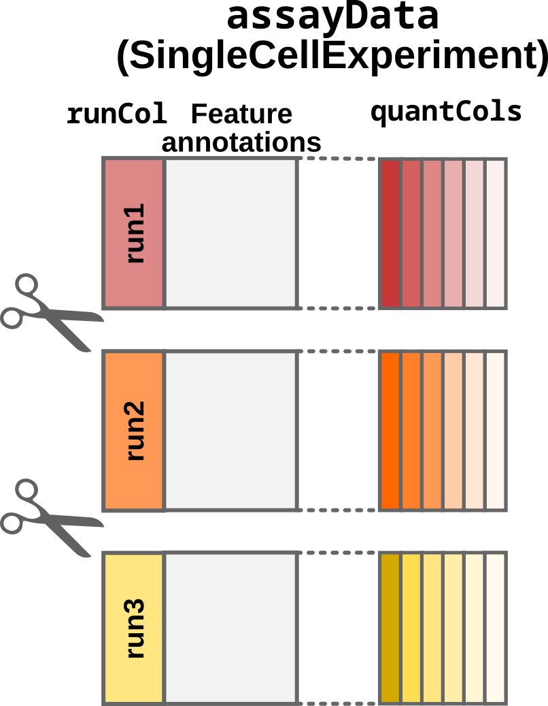

# Load mass spectrometry-based proteomics data using \`readQFeatures()\`

## The `QFeatures` class

The `QFeatures` class stores data as a list of `SummarizedExperiment`
objects that contain data processed at different levels. For instance, a
`QFeatures` object may contain data at the peptide-to-spectrum-match
(PSM) level, at the peptide level and at the protein level. We call each
`SummarizedExperiment` object contained in a `QFeatures` object a *set*.
Because the different sets are often related, they often share the same
samples (columns). `QFeatures` automatically creates links between the
related samples and their annotations (stored in a single `colData`
table). Similarly, different sets often share related features (rows).
For instance, proteins are composed of peptides and peptides are
composed of PSMs. `QFeatures` automatically creates links between the
related features through an `AssayLinks` object.

)
on \`SingleCellExperiment\` and \`QFeatures\`
objects](figs/readQFeatures_class.png)

The `QFeatures` data class. The `QFeatures` object contains a list of
`SummarizedExperiment` ojects (see [class
description](https://bioconductor.org/packages/release/bioc/vignettes/SummarizedExperiment/inst/doc/SummarizedExperiment.html))
on `SingleCellExperiment` and `QFeatures` objects

``` r

library("QFeatures")
```

## Converting tabular data

`QFeatures` is designed to process and manipulate the MS-based
proteomics data obtained after identification and quantification of the
raw MS files. The identification and quantification steps are generally
performed by dedicated software (e.g. Sage, FragPipe, Proteome
Discoverer, MaxQuant, …) that return a set of tabular data.
[`readQFeatures()`](https://rformassspectrometry.github.io/QFeatures/reference/readQFeatures.md)
converts these tabular data into a `QFeatures` object. We refer to these
tables as the `assayData` tables.

We distinguish between two use cases: the single-set case and the
multi-set case.

### The single-set case

The single-set case will generate a `QFeatures` object with a single
`SummarizedExperiment` object. This is generally the case when reading
data at the peptide or protein level, or when the samples where
multiplexed (e.g. using TMT) within a single MS run. There are two types
of columns:

- Quantitative columns (`quantCols`): 1 to n (depending on technology)
- Feature annotations: *e.g.* peptide sequence, ion charge, protein name

In this case, each quantitative column contains information for a single
sample. This can be schematically represented as below:


Schematic representation of a data table under the single-set case.
Quantification columns (`quantCols`) are represented by different shades
of red.

The hyperLOPIT data is an example data that falls under the single-set
case (see
[`?hlpsms`](https://rformassspectrometry.github.io/QFeatures/reference/hlpsms.md)
for more details). The `quantCols` are `X126`, `X127N`, `X127C`, …,
`X130N`, `X130C`, `X131` and correspond to different TMT labels.

In this toy example, there are 3,010 rows corresponding to features
(quantified PSMs) and 28 columns corresponding to different data fields
generated by MaxQuant during the analysis of the raw MS spectra. The
table is converted to a `QFeatures` object as follows:

``` r

data("hlpsms")
quantCols <- grep("^X", colnames(hlpsms))
(qfSingle <- readQFeatures(hlpsms, quantCols = quantCols))
#> Checking arguments.
#> Loading data as a 'SummarizedExperiment' object.
#> Formatting sample annotations (colData).
#> Formatting data as a 'QFeatures' object.
#> An instance of class QFeatures (type: bulk) with 1 set:
#> 
#>  [1] quants: SummarizedExperiment with 3010 rows and 10 columns
```

The object returned by
[`readQFeatures()`](https://rformassspectrometry.github.io/QFeatures/reference/readQFeatures.md)
is a `QFeatures` object containing 1 `SummarizedExperiment` set. The set
is named `quants` by default, but we could name it `psms` by providing
the `name` argument:

``` r

(qfSingle <- readQFeatures(hlpsms, quantCols = quantCols, name = "psms"))
#> Checking arguments.
#> Loading data as a 'SummarizedExperiment' object.
#> Formatting sample annotations (colData).
#> Formatting data as a 'QFeatures' object.
#> An instance of class QFeatures (type: bulk) with 1 set:
#> 
#>  [1] psms: SummarizedExperiment with 3010 rows and 10 columns
```

### The multi-set case

The multi-set case will generate a `QFeatures` object with multiple
`SummarizedExperiment` objects. This is generally the case when reading
data at the PSM level that has been acquired as part of multiple runs.
In this case, the identification and quantification software
concatenates the results across MS runs in a single table. There are
three types of columns:

- Run identifier column (`runCol`): *e.g.* file name.
- Quantification columns (`quantCols`): 1 to n (depending on
  technology).
- Feature annotations: *e.g.* peptide sequence, ion charge, protein
  name.

Each quantitative column contains information for multiple samples. This
can be schematically represented as below:


Schematic representation of a data table under the multi-set case.
Quantification columns (`quantCols`) are coloured by run and shaded by
label. Every sample is uniquely represented by a colour and shade. Note
that every `quantCol` contains multiple samples.

We will again use hyperLOPIT data and simulate it was acquired as part
of multiple runs, hence falling under the multi-set case. The MS run is
often identified with the name of the file it generated.

``` r

hlpsms$FileName <- rep(
    rep(paste0("run", 1:3, ".raw"), each = 4), 
    length.out = nrow(hlpsms)
)
```

Note that the data set now has a column called “FileName” with 3
different runs:

To avoid that a quantification column contains data from multiple
samples,
[`readQFeatures()`](https://rformassspectrometry.github.io/QFeatures/reference/readQFeatures.md)
splits the table into mulitple set depending on the `runCol` column,
here given as `FileName`:

``` r

(qfMulti <- readQFeatures(hlpsms, quantCols = quantCols, runCol = "FileName"))
#> Checking arguments.
#> Loading data as a 'SummarizedExperiment' object.
#> Splitting data in runs.
#> Formatting sample annotations (colData).
#> Formatting data as a 'QFeatures' object.
#> An instance of class QFeatures (type: bulk) with 3 sets:
#> 
#>  [1] run1.raw: SummarizedExperiment with 1004 rows and 10 columns 
#>  [2] run2.raw: SummarizedExperiment with 1004 rows and 10 columns 
#>  [3] run3.raw: SummarizedExperiment with 1002 rows and 10 columns
```

The object returned by
[`readQFeatures()`](https://rformassspectrometry.github.io/QFeatures/reference/readQFeatures.md)
is a `QFeatures` object containing 3 `SummarizedExperiment` sets. The
sets are automatically named based on the values found in `runCol`.

## Including sample annotations

Data often comes with sample annotations that provide information about
the experimental design. These data are generally created by the user.
To facilitate sample annotations,
[`readQFeatures()`](https://rformassspectrometry.github.io/QFeatures/reference/readQFeatures.md)
also allows providing the annotation table as the `colData` argument.
Depending on the use case, one or multiple columns are required.

For the single-set case, the `colData` table must contain a column named
`quantCols`.


`colData` for the single-set case

Let’s simulate such a table:

``` r

(coldata <- DataFrame(
    quantCols = quantCols, 
    condition = rep(c("A", "B"), 5), 
    batch = rep(c("batch1", "batch2"), each = 5)
))
#> DataFrame with 10 rows and 3 columns
#>    quantCols   condition       batch
#>    <integer> <character> <character>
#> 1          1           A      batch1
#> 2          2           B      batch1
#> 3          3           A      batch1
#> 4          4           B      batch1
#> 5          5           A      batch1
#> 6          6           B      batch2
#> 7          7           A      batch2
#> 8          8           B      batch2
#> 9          9           A      batch2
#> 10        10           B      batch2
```

We can now provide the table to
[`readQFeatures()`](https://rformassspectrometry.github.io/QFeatures/reference/readQFeatures.md):

``` r

(qfSingle <- readQFeatures(hlpsms, quantCols = quantCols, colData = coldata))
#> Checking arguments.
#> Loading data as a 'SummarizedExperiment' object.
#> Formatting sample annotations (colData).
#> Formatting data as a 'QFeatures' object.
#> An instance of class QFeatures (type: bulk) with 1 set:
#> 
#>  [1] quants: SummarizedExperiment with 3010 rows and 10 columns
```

For convenience, the `quantCols` argument can be omitted when providing
`colData` (`quantCols` are then fetched from this table):

``` r

(qfSingle <- readQFeatures(hlpsms, colData = coldata))
#> Checking arguments.
#> Loading data as a 'SummarizedExperiment' object.
#> Formatting sample annotations (colData).
#> Formatting data as a 'QFeatures' object.
#> An instance of class QFeatures (type: bulk) with 1 set:
#> 
#>  [1] quants: SummarizedExperiment with 3010 rows and 10 columns
```

The annotations are retrieved as follows:

``` r

colData(qfSingle)
#> DataFrame with 10 rows and 3 columns
#>       quantCols   condition       batch
#>       <integer> <character> <character>
#> X126         NA          NA          NA
#> X127C        NA          NA          NA
#> X127N        NA          NA          NA
#> X128C        NA          NA          NA
#> X128N        NA          NA          NA
#> X129C        NA          NA          NA
#> X129N        NA          NA          NA
#> X130C        NA          NA          NA
#> X130N        NA          NA          NA
#> X131         NA          NA          NA
```

For the multi-set case, the `colData` table must contain a column named
`quantCols` and a column called `runCol`.


`colData` for the multi-set case

Let’s simulate an annotation table based on our previous example by
duplicating the table for each run:

``` r

coldataMulti <- DataFrame()
for (run in paste0("run", 1:3, ".raw")) {
    coldataMulti <- rbind(coldataMulti, DataFrame(runCol = run, coldata))
}
coldataMulti
#> DataFrame with 30 rows and 4 columns
#>          runCol quantCols   condition       batch
#>     <character> <integer> <character> <character>
#> 1      run1.raw         1           A      batch1
#> 2      run1.raw         2           B      batch1
#> 3      run1.raw         3           A      batch1
#> 4      run1.raw         4           B      batch1
#> 5      run1.raw         5           A      batch1
#> ...         ...       ...         ...         ...
#> 26     run3.raw         6           B      batch2
#> 27     run3.raw         7           A      batch2
#> 28     run3.raw         8           B      batch2
#> 29     run3.raw         9           A      batch2
#> 30     run3.raw        10           B      batch2
```

We can provide the table to
[`readQFeatures()`](https://rformassspectrometry.github.io/QFeatures/reference/readQFeatures.md):

``` r

(qfMulti <- readQFeatures(
    hlpsms, quantCols = quantCols, colData = coldataMulti, 
    runCol = "FileName"
))
#> Checking arguments.
#> Loading data as a 'SummarizedExperiment' object.
#> Splitting data in runs.
#> Formatting sample annotations (colData).
#> Formatting data as a 'QFeatures' object.
#> An instance of class QFeatures (type: bulk) with 3 sets:
#> 
#>  [1] run1.raw: SummarizedExperiment with 1004 rows and 10 columns 
#>  [2] run2.raw: SummarizedExperiment with 1004 rows and 10 columns 
#>  [3] run3.raw: SummarizedExperiment with 1002 rows and 10 columns
```

## Additional information

### Sample names

[`readQFeatures()`](https://rformassspectrometry.github.io/QFeatures/reference/readQFeatures.md)
automatically assigns names that are unique across all samples in all
sets. In the single-set case, sample names are provided by `quantCols`.

``` r

colnames(qfSingle)
#> CharacterList of length 1
#> [["quants"]] X126 X127C X127N X128C X128N X129C X129N X130C X130N X131
```

In the multi-set case, sample names are the concatenation of the run
name and the quantCols (separated by a `_`).

``` r

colnames(qfMulti)
#> CharacterList of length 3
#> [["run1.raw"]] run1.raw_X126 run1.raw_X127C ... run1.raw_X130N run1.raw_X131
#> [["run2.raw"]] run2.raw_X126 run2.raw_X127C ... run2.raw_X130N run2.raw_X131
#> [["run3.raw"]] run3.raw_X126 run3.raw_X127C ... run3.raw_X130N run3.raw_X131
```

### Special case: empty samples

In some rare cases, it can be beneficial to remove samples where all
quantifications are `NA`. This can occur when the raw data are searched
for labels that were not used during the experiment. For instance, some
may quantifying the raw data expecting TMT-16 labelling while the
experiment used TMT-11 labels, or used half of the TMT-16 labels. The
missing label channels are filled with `NA`s. When setting
`removeEmptyCols = TRUE`,
[`readQFeatures()`](https://rformassspectrometry.github.io/QFeatures/reference/readQFeatures.md)
automatically detects and removes columns containing only `NA`s.

``` r

hlpsms$X126 <- NA
(qfNoEmptyCol <- readQFeatures(
    hlpsms, quantCols = quantCols, removeEmptyCols = TRUE
))
#> Checking arguments.
#> Loading data as a 'SummarizedExperiment' object.
#> Formatting sample annotations (colData).
#> Formatting data as a 'QFeatures' object.
#> An instance of class QFeatures (type: bulk) with 1 set:
#> 
#>  [1] quants: SummarizedExperiment with 3010 rows and 9 columns
```

Note that we have set all values in `X126` to missing. Hence, the set
contains only 9 columns instead of the previous 10.

### Reducing verbose

Every call to
[`readQFeatures()`](https://rformassspectrometry.github.io/QFeatures/reference/readQFeatures.md)
prints progression to the console. To disable the console output, you
can use the `verbose` argument:

``` r

(qfSingle <- readQFeatures(
    hlpsms, quantCols = quantCols, verbose = FALSE
))
#> An instance of class QFeatures (type: bulk) with 1 set:
#> 
#>  [1] quants: SummarizedExperiment with 3010 rows and 10 columns
```

## Under the hood

`readQFeatures` proceeds as follows:

1.  The `assayData` table must be provided as a `data.frame` (or any
    format that can be coerced to a `data.frame`).
    [`readQFeatures()`](https://rformassspectrometry.github.io/QFeatures/reference/readQFeatures.md)
    converts the table to a `SingleCellExperiment` object using
    `quantCols` to identify the quantitative values that are stored in
    the `assay` slot. Any other column is considered as feature
    annotation and will be stored as `rowData`.


Step1: Convert the input table to a `SingleCellExperiment` object

2.  (Only for the multi-set case:) The `SingleCellExperiment` object is
    split according to the acquisition run provided by the `runCol`
    column in `assayData`.



Step2: Split by acquisition run

3.  The sample annotations are generated. If no `colData` is provided,
    the sample annotations are empty. Otherwise,
    [`readQFeatures()`](https://rformassspectrometry.github.io/QFeatures/reference/readQFeatures.md)
    matches the information from `assayData` and `colData` based on
    `quantCols` (single-set case) or `quantCols` and `runCol` (multi-set
    case). Sample annotations are stored in the `colData` slot of the
    `QFeatures` object.


Step3: Adding and matching the sample annotations

4.  Finally, the `SummarizedExperiment` sets and the `colData` are
    converted to a `QFeatures` object.


Step4: Converting to a `QFeatures`

## What about other input formats?

[`readQFeatures()`](https://rformassspectrometry.github.io/QFeatures/reference/readQFeatures.md)
should work with any PSM quantification table that is output by a
pre-processing software. For instance, you can easily import the PSM
tables generated by Proteome Discoverer. The run names are contained in
the `File ID` column (that should be supplied as the `runCol` argument
to
[`readQFeatures()`](https://rformassspectrometry.github.io/QFeatures/reference/readQFeatures.md)).
The quantification columns are contained in the columns starting with
`Abundance`, eventually followed by a multiplexing tag name. These
columns should be stored in a dedicated column in the `colData` data to
be supplied as `runCol` to
[`readQFeatures()`](https://rformassspectrometry.github.io/QFeatures/reference/readQFeatures.md).

The `QFeatures` package is meant for both label-free and multiplexed
proteomics data. Importing LFQ data is similar to the examples above
with the only difference that `quantCols` would have only 1 element.

The `readSCPfromDIANN()` function is adapted to import label-free and
plexDIA/mTRAQ `Report.tsv` files generated by DIA-NN.

For more information, see the `?readQFeatures()` and
`?readQFeaturesFromDIANN()` manual pages, that described the main
principle that concern the data import and formatting.

If your input cannot be loaded using the procedure described in this
vignette, you can submit a feature request (see next section).

## Need help?

You can open an issue on the [GitHub
repository](https://github.com/rformassspectrometry/QFeatures/issues) in
case of troubles when loading your data with
[`readQFeatures()`](https://rformassspectrometry.github.io/QFeatures/reference/readQFeatures.md).
Any suggestion or feature request about the function or the
documentation are also warmly welcome.

## Session information

    R version 4.5.1 (2025-06-13)
    Platform: x86_64-pc-linux-gnu
    Running under: Ubuntu 24.04.3 LTS

    Matrix products: default
    BLAS:   /usr/lib/x86_64-linux-gnu/openblas-pthread/libblas.so.3 
    LAPACK: /usr/lib/x86_64-linux-gnu/openblas-pthread/libopenblasp-r0.3.26.so;  LAPACK version 3.12.0

    locale:
     [1] LC_CTYPE=en_US.UTF-8       LC_NUMERIC=C              
     [3] LC_TIME=en_US.UTF-8        LC_COLLATE=en_US.UTF-8    
     [5] LC_MONETARY=en_US.UTF-8    LC_MESSAGES=en_US.UTF-8   
     [7] LC_PAPER=en_US.UTF-8       LC_NAME=C                 
     [9] LC_ADDRESS=C               LC_TELEPHONE=C            
    [11] LC_MEASUREMENT=en_US.UTF-8 LC_IDENTIFICATION=C       

    time zone: UTC
    tzcode source: system (glibc)

    attached base packages:
    [1] stats4    stats     graphics  grDevices utils     datasets  methods  
    [8] base     

    other attached packages:
     [1] DT_0.34.0                   QFeatures_1.19.3           
     [3] MultiAssayExperiment_1.35.9 SummarizedExperiment_1.39.2
     [5] Biobase_2.69.1              GenomicRanges_1.61.5       
     [7] Seqinfo_0.99.2              IRanges_2.43.5             
     [9] S4Vectors_0.47.4            BiocGenerics_0.55.4        
    [11] generics_0.1.4              MatrixGenerics_1.21.0      
    [13] matrixStats_1.5.0           BiocStyle_2.37.1           

    loaded via a namespace (and not attached):
     [1] xfun_0.53               bslib_0.9.0             htmlwidgets_1.6.4      
     [4] lattice_0.22-7          crosstalk_1.2.2         vctrs_0.6.5            
     [7] tools_4.5.1             tibble_3.3.0            cluster_2.1.8.1        
    [10] pkgconfig_2.0.3         BiocBaseUtils_1.11.2    Matrix_1.7-4           
    [13] desc_1.4.3              lifecycle_1.0.4         compiler_4.5.1         
    [16] stringr_1.5.2           textshaping_1.0.4       clue_0.3-66            
    [19] htmltools_0.5.8.1       sass_0.4.10             yaml_2.3.10            
    [22] lazyeval_0.2.2          pkgdown_2.1.3.9000      pillar_1.11.1          
    [25] crayon_1.5.3            jquerylib_0.1.4         tidyr_1.3.1            
    [28] MASS_7.3-65             DelayedArray_0.35.3     cachem_1.1.0           
    [31] abind_1.4-8             tidyselect_1.2.1        digest_0.6.37          
    [34] stringi_1.8.7           purrr_1.1.0             dplyr_1.1.4            
    [37] reshape2_1.4.4          bookdown_0.45           fastmap_1.2.0          
    [40] grid_4.5.1              cli_3.6.5               SparseArray_1.9.1      
    [43] magrittr_2.0.4          S4Arrays_1.9.1          rmarkdown_2.30         
    [46] XVector_0.49.1          igraph_2.2.0            ragg_1.5.0             
    [49] evaluate_1.0.5          knitr_1.50              rlang_1.1.6            
    [52] Rcpp_1.1.0              glue_1.8.0              BiocManager_1.30.26    
    [55] jsonlite_2.0.0          AnnotationFilter_1.33.0 R6_2.6.1               
    [58] plyr_1.8.9              systemfonts_1.3.1       fs_1.6.6               
    [61] ProtGenerics_1.41.0     MsCoreUtils_1.21.0     

## License

This vignette is distributed under a [CC BY-SA
license](https://creativecommons.org/licenses/by-sa/2.0/) license.

## Reference
