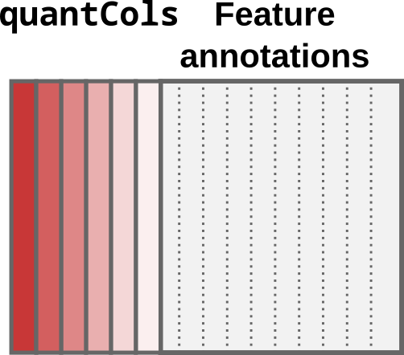
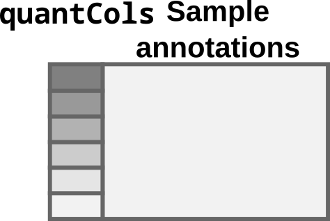
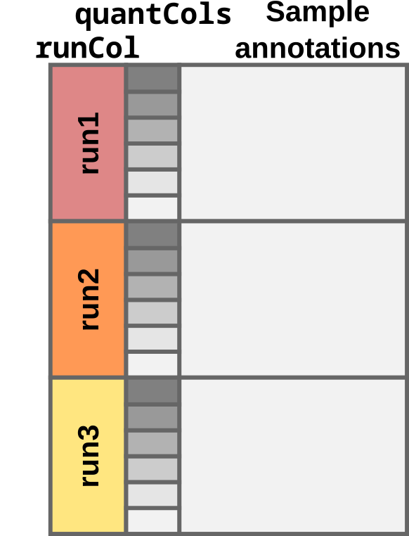
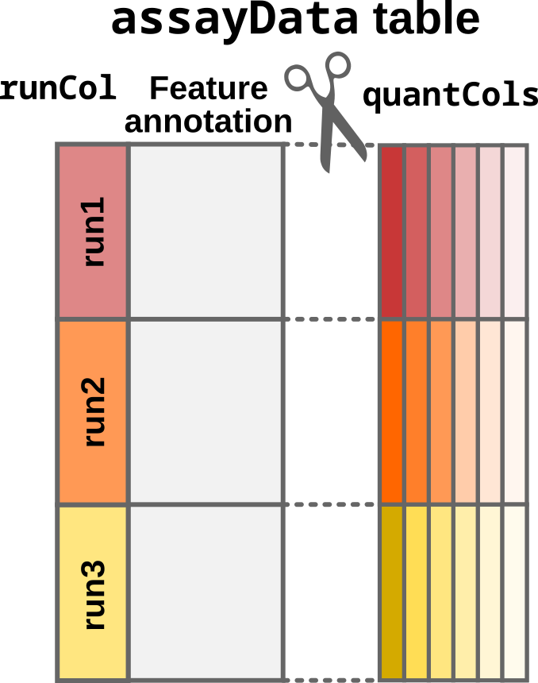
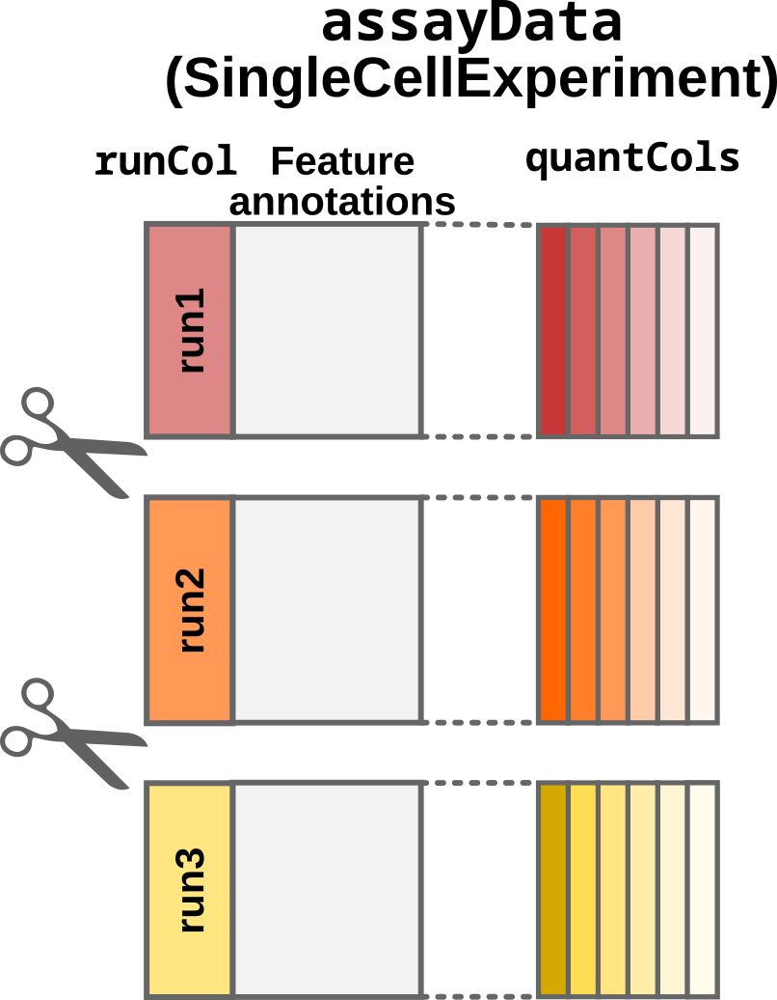
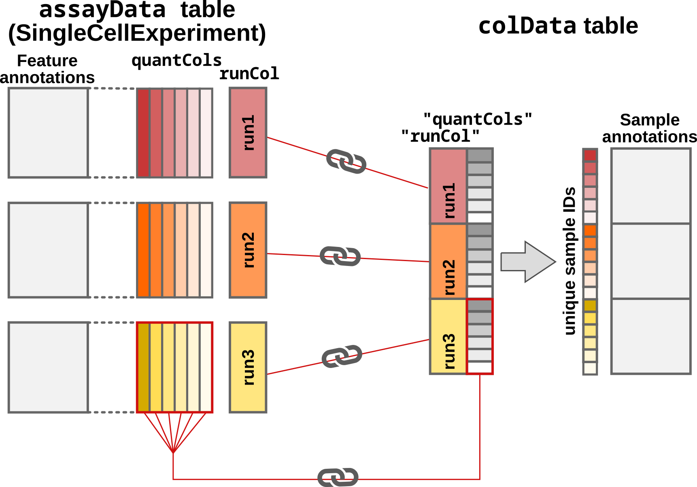
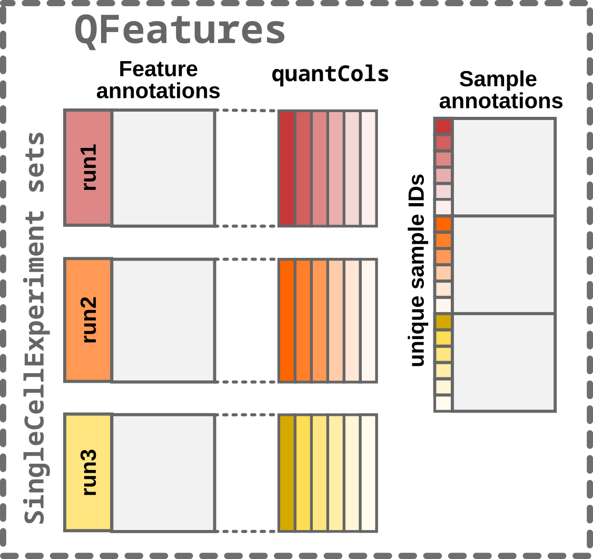

```{r setup, include = FALSE}
knitr::opts_chunk$set(
    collapse = TRUE,
    comment = "#>",
    crop = NULL
    ## cf to https://stat.ethz.ch/pipermail/bioc-devel/2020-April/016656.html
)
```

# The `QFeatures` class

The `QFeatures` class stores data as a list of `SummarizedExperiment`
objects that contain data processed at different levels. For instance,
a `QFeatures` object may contain data at the peptide-to-spectrum-match
(PSM) level, at the peptide level and at the protein level. We call
each `SummarizedExperiment` object contained in a `QFeatures` object
a *set*. Because the different sets are often related, they often share
the same samples (columns). `QFeatures` automatically creates links 
between the related samples and their annotations (stored in a single
`colData` table). Similarly, different sets often share related 
features (rows). For instance, proteins are composed of peptides and 
peptides are composed of PSMs. `QFeatures` automatically creates links 
between the related features through an `AssayLinks` object. 

```{r, fig.cap="The `QFeatures` data class. The `QFeatures` object contains a list of `SummarizedExperiment` ojects (see [class description](https://bioconductor.org/packages/release/bioc/vignettes/SummarizedExperiment/inst/doc/SummarizedExperiment.html)) on `SingleCellExperiment` and `QFeatures` objects", echo=FALSE, out.width='100%'}
knitr::include_graphics("figs/readQFeatures_class.png")
```

```{r, message=FALSE}
library("QFeatures")
```


# Converting tabular data

`QFeatures` is designed to process and manipulate the MS-based 
proteomics data obtained after identification and quantification of
the raw MS files. The identification and quantification steps are 
generally performed by dedicated software (e.g. Sage, FragPipe, 
Proteome Discoverer, MaxQuant, ...) that return a set of tabular data.
`readQFeatures()` converts these tabular data into a `QFeatures` 
object. We refer to these tables as the `assayData` tables.

We distinguish between two use cases: the single-set case and
the multi-set case. 

## The single-set case

The single-set case will generate a `QFeatures` object with a single 
`SummarizedExperiment` object. This is generally the case when reading
data at the peptide or protein level, or when the samples where 
multiplexed (e.g. using TMT) within a single MS run. There are two 
types of columns:

- Quantitative columns (`quantCols`): 1 to n (depending on 
  technology)
- Feature annotations: *e.g.* peptide sequence, ion charge, protein 
  name

In this case, each quantitative column contains information for a
single sample. This can be schematically represented as below: 

```{r, fig.cap="Schematic representation of a data table under the single-set case. Quantification columns (`quantCols`) are represented by different shades of red.", echo=FALSE, out.width='150px'}

```

The hyperLOPIT data is an example data that falls under the single-set
case (see `?hlpsms` for more details). The `quantCols` are `X126`, 
`X127N`, `X127C`, ..., `X130N`, `X130C`, `X131` and correspond to 
different TMT labels. 

```{r, echo = FALSE, warning=FALSE}
data("hlpsms")
quantCols <- grep("^X", colnames(hlpsms), value = TRUE)
library(DT)
formatStyle(datatable(hlpsms[, -12]),
            quantCols,
            backgroundColor = "#d35f5f"
) |> 
    formatRound(quantCols, digits = 4)
```

In this toy example, there are 3,010 rows corresponding to features
(quantified PSMs) and 28 columns corresponding to different data
fields generated by MaxQuant during the analysis of the raw MS
spectra. The table is converted to a `QFeatures` object as follows: 

```{r readQFeatures_singlset}
data("hlpsms")
quantCols <- grep("^X", colnames(hlpsms))
(qfSingle <- readQFeatures(hlpsms, quantCols = quantCols))
```

The object returned by `readQFeatures()` is a `QFeatures`
object containing 1 `SummarizedExperiment` set. The set is named 
`quants` by default, but we could name it `psms` by providing the 
`name` argument:

```{r}
(qfSingle <- readQFeatures(hlpsms, quantCols = quantCols, name = "psms"))
```

## The multi-set case

The multi-set case will generate a `QFeatures` object with multiple
`SummarizedExperiment` objects. This is generally the case when 
reading data at the PSM level that has been acquired as part of 
multiple runs. In this case, the identification and quantification 
software concatenates the results across MS runs in a single table. 
There are three types of columns:

- Run identifier column (`runCol`): *e.g.* file name.
- Quantification columns (`quantCols`): 1 to n (depending on 
  technology).
- Feature annotations: *e.g.* peptide sequence, ion charge, protein 
  name.

Each quantitative column contains information for multiple samples. 
This can be schematically represented as below: 

```{r, fig.cap="Schematic representation of a data table under the multi-set case. Quantification columns (`quantCols`) are coloured by run and shaded by label. Every sample is uniquely represented by a colour and shade. Note that every `quantCol` contains multiple samples.", echo=FALSE, out.width='180px'}
knitr::include_graphics("figs/readQFeatures_assayData_multi.png")
```

We will again use hyperLOPIT data and simulate it was acquired as part
of multiple runs, hence falling under the multi-set case. The MS run 
is often identified with the name of the file it generated.

```{r}
hlpsms$FileName <- rep(rep(paste0("run", 1:3, ".raw"), each = 4), length.out = nrow(hlpsms))
```

Note that the data set now has a column called "FileName" with 3 
different runs:

```{r, echo = FALSE}
formatStyle(
    datatable(cbind(hlpsms["FileName"], hlpsms[, -ncol(hlpsms)])[, -13]),
    1:11,
    valueColumns = "FileName",
    backgroundColor = styleEqual(
        unique(hlpsms$FileName), c('#d35f5f', "orange", 'yellow')
    )
) |> 
    formatRound(2:11, digits = 4)
```

To avoid that a quantification column contains multiple samples, 
`readQFeatures()` splits the table into mulitple set depending on the 
`runCol` column, here given as `FileName`: 

```{r readQFeatures_multiset}
(qfMulti <- readQFeatures(hlpsms, quantCols = quantCols, runCol = "FileName"))
```

The object returned by `readQFeatures()` is a `QFeatures`
object containing 3 `SummarizedExperiment` sets. The sets are 
automatically named based on the values found in `runCol`.

# Including sample annotations

Data often comes with sample annotations that provide information 
about the experimental design. These data are generally created by the
user. To facilitate sample annotations, `readQFeatures()` also allows
providing the annotation table as the `colData` argument. Depending 
on the use case, one or multiple columns are required. 

For the single-set case, the `colData` table must contain a column
named `quantCols`. 

```{r echo=FALSE, out.width='140px', include=TRUE, fig.cap="`colData` for the single-set case"}

```


Let's simulate such as table:

```{r}
(coldata <- DataFrame(
    quantCols = quantCols, 
    condition = rep(c("A", "B"), 5), 
    batch = rep(c("batch1", "batch2"), each = 5)
))
```

We can now provide the table to `readQFeatures()`:

```{r}
(qfSingle <- readQFeatures(hlpsms, quantCols = quantCols, colData = coldata))
```

For convenience, the `quantCols` argument can be omitted when 
providing `colData` (`quantCols` are then fetched from this table):

```{r}
(qfSingle <- readQFeatures(hlpsms, colData = coldata))
```

The annotations are retrieved as follows: 

```{r}
colData(qfSingle)
```

For the multi-set case, the `colData` table must contain a column
named `quantCols` and a column called `runCol`. 

```{r echo=FALSE, out.width='175px', include=TRUE, fig.cap="`colData` for the multi-set case"}

```

Let's build this table based on our previous example by duplicating 
the table for each run (note this is a **bad** experimental design
practice):

```{r}
coldataMulti <- DataFrame()
for (run in paste0("run", 1:3, ".raw")) {
    coldataMulti <- rbind(coldataMulti, DataFrame(runCol = run, coldata))
}
coldataMulti
```

We can provide the table to `readQFeatures()`:

```{r}
(qfMulti <- readQFeatures(
    hlpsms, quantCols = quantCols, colData = coldataMulti, 
    runCol = "FileName"
))
```

# Additional information

## Sample names

`readQFeatures()` automatically assigns names that are unique across 
all samples in all sets. In the single-set case, sample names are
provided by `quantCols`. 

```{r}
colnames(qfSingle)
```

In the multi-set case, sample names are the concatenation of the run
name and the quantCols (separated by a `_`). 

```{r}
colnames(qfMulti)
```

## Special case: empty samples

In some rare cases, it can be beneficial to remove empty samples (all
quantifications are `NA`) from the sets. This can occur when the raw 
data are searched for labels that were not used during the 
experiment. For instance, some may quantifying the raw data expecting
TMT-16 labelling while the experiment used TMT-11 labels, or used half
of the TMT-16 labels. The missing label channels are filled with 
`NA`s. When setting `removeEmptyCols = TRUE`, `readQFeatures()` 
automatically detects and removes columns containing only `NA`s.

```{r}
hlpsms$X126 <- NA
(qfNoEmptyCol <- readQFeatures(
    hlpsms, quantCols = quantCols, removeEmptyCols = TRUE
))
```

Note that we have set all values in `X126` to missing. Hence, the set
contains only 9 columns instead of the previous 10.

## Reducing verbose

Every call to `readQFeatures()` prints progression to the console. To
disable the console output, you can use the `verbose` argument: 

```{r}
(qfSingle <- readQFeatures(
    hlpsms, quantCols = quantCols, verbose = FALSE
))
```

# Under the hood

`readQFeatures` proceeds as follows:

1. The `assayData` table must be provided as a `data.frame` (or any 
   format that can be coerced to a `data.frame`). `readQFeatures()` 
   converts the table to a `SingleCellExperiment` object using
   `quantCols` to identify the quantitative values that are stored in 
   the `assay` slot. Any other column is considered as feature 
   annotation and will be stored as `rowData`.

```{r echo=FALSE, out.width='200px', include=TRUE,fig.cap="Step1: Convert the input table to a `SingleCellExperiment` object"}

```

2. (Only for the multi-set case:) The `SingleCellExperiment` object is
   split according to the acquisition run provided by the `runCol` 
   column in `assayData`. 

```{r echo=FALSE, out.width='240px', fig.cap="Step2: Split by acquisition run"}

```

3. The sample annotations are generated. If no `colData` is provided,
   the sample annotations are empty. Otherwise, `readQFeatures()` 
   matches the information from `assayData` and `colData` based on
   `quantCols` (single-set case) or `quantCols` and `runCol`
   (multi-set case). Sample annotations are stored in the `colData`
   slot of the `QFeatures` object. 

```{r echo=FALSE, out.width='520px', fig.cap="Step3: Adding and matching the sample annotations"}

```

4. Finally, the `SummarizedExperiment` sets and the `colData` are
   converted to a `QFeatures` object.

```{r echo=FALSE, out.width='340px', fig.cap="Step4: Converting to a `QFeatures`"}

```

# What about other input formats?

`readQFeatures()` should work with any PSM quantification table that is
output by a pre-processing software. For instance, you can easily
import the PSM tables generated by Proteome Discoverer. The run names
are contained in the `File ID` column (that should be supplied as the
`runCol` argument to `readQFeatures()`). The quantification columns are
contained in the columns starting with `Abundance `, eventually
followed by a multiplexing tag name. These columns should be stored in
a dedicated column in the `colData` data to be supplied as `runCol`
to `readQFeatures()`.

The `QFeatures` package is meant for both label-free and multiplexed 
proteomics data. Importing LFQ data is similar to the examples above 
with the only difference that `quantCols` would have only 1 element.

The `readSCPfromDIANN()` function is adapted to import label-free and
plexDIA/mTRAQ `Report.tsv` files generated by DIA-NN.

For more information, see the `readQFeatures()` and
`readQFeaturesFromDIANN()` manual pages, that described the main
principle that concern the data import and formatting.

If your input cannot be loaded using the procedure described in this
vignette, you can submit a feature request (see next section).

# Need help?

You can open an issue on the [GitHub
repository](https://github.com/rformassspectrometry/QFeatures/issues) 
in case of troubles when loading your data with `readQFeatures()`. Any
suggestion or feature request about the function or the documentation
are also warmly welcome.

# Session information {-}

```{r setup2, include = FALSE}
knitr::opts_chunk$set(
    collapse = TRUE,
    comment = "",
    crop = NULL
)
```

```{r sessioninfo, echo=FALSE}
sessionInfo()
```

# License {-}

This vignette is distributed under a
[CC BY-SA license](https://creativecommons.org/licenses/by-sa/2.0/)
license.

# Reference {-}
